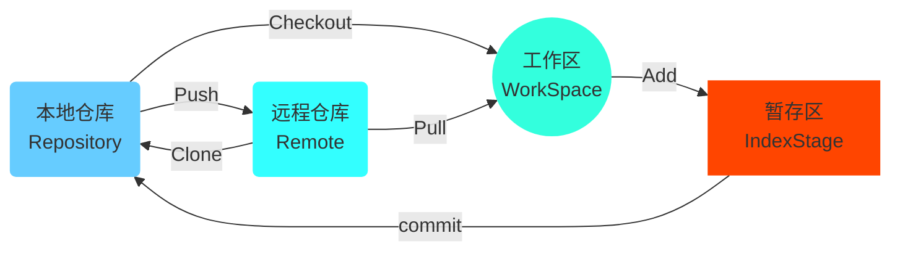

## Git的使用（一）

### 前言

在Git之前，用的比较多的版本控制系统是SVN。SVN是集中式版本控制系统，版本库集中放在中央服务器，当开发人员工作的时候，首先要从中央服务器下载最新的版本，然后进行开发，开发完后，再把自己开发的代码提交到中央服务器中。SVN是一个典型的CS结构的系统。但是这种系统存在着服务器单点故障和容错性差的缺点。所以Git在此方面解决了这些问题，也就是说Git是分布式版本控制系统。Git中存在两种类型的仓库，本地仓库和远程仓库。开发人员通过Clone将远程仓库克隆到本地，然后通过Pull命令将远程仓库中的代码拉取到本地，这时开发人员在远程仓库中所拥有的代码的基础上进行开发，开发完成后通过Push命令将代码再提交到远程仓库。

### Git的工作流程



首先从远程仓库中克隆代码到本地仓库，然后从本地仓库中检出代码并进行修改补充（在工作区中），修改补充完成后将代码先提交到暂存区，然后从暂存区提交代码到本地仓库（本地仓库将保存修改的各个历史版本），最后将代码提交到远程仓库。

### Git基本概念

#### 1.常见名称解释

|       常见名称       |                             解释                             |
| :------------------: | :----------------------------------------------------------: |
|        版本库        | 在Git本地仓库下存在的`.git`文件夹就是版本库，它其中含有很多配置信息、日志信息和文件版本信息等。通过git命令我们可以将一些信息进行查看和更改，且不需要手动去修改`.git`文件夹下的内容。 |
| 工作目录（或工作区） | 包含`.git`文件夹的目录就是工作目录，主要用来存放开发的一些代码。 |
|        暂存区        | 在`.git`文件夹下有一个index文件，该文件就是暂存区，也叫做stage。主要用来临时保存修改的文件，我们每次提交之前都需要使用`git add .`或其他命令将文件提交到暂存区，然后再向远程仓库进行push。 |

#### 2.常见状态解释

|   状态    |                             解释                             |
| :-------: | :----------------------------------------------------------: |
| untracked |            未跟踪状态，也叫做未被纳入版本控制状态            |
|  tracked  | 以跟踪状态，也叫做被纳入版本控制状态。该状态下还存在着三种状态，如下：<br>Unmodified  未被修改状态<br>Modified  已修改状态<br>Staged  已暂存状态 |

Git工作目录下的文件存在两种状态：untracked和tracked状态，这些文件的状态会随着执行的Git命令进行改变。

#### 3.`.gitignore`文件解释

有时我们不想将一些文件纳入Git管理，也不希望它们出现在未跟踪的列表中。例如：日志文件、代码编译后的文件等。这时我们可以在工作区目录下创建一个`.gitignore`文件，将一些不需要进行Git管理的文件进行规定，这时再进行提交时就不会提交一些我们不想提交的文件了。该`.gitignore`文件示例如下：

```gitignore
# no .a files
*.a
# but do track lib.a, even though you're ignoring .a files above
!lib.a
# only ignore the TODO file in the current directory, not subdir/TODO
/TODO
# ignore all files in the build/ directory
build/
# ignore doc/notes.txt, but not doc/server/arch.txt
doc/*.txt
# ignore all .pdf files in the doc/ directory
doc/**/*.pdf
```

**注意**：该文件中指定的如`*.a`类型的文件，也就是以`.a`结尾的文件为过滤对象，也就是除`lib.a`文件外的其他`.a`文件都进行忽略。第六行表示当前目录下的`TODO`文件进行忽略，第八行表示build目录下的所有文件进行忽略。其他的表示方法类似。这个`.gitignore`文件可以通过在Git Bash中键入命令` touch .gitignore`进行生成，但没有模板需要手动去写，除此之外可以在GitHub下找到该文件的模板，针对部分内容进行修改即可。

### Git常用命令

#### 1.环境配置

|                       命令                       |                   作用                   |
| :----------------------------------------------: | :--------------------------------------: |
|               `git config --list`                |            查看全部的配置信息            |
|              `git config user.name`              |           查看用户名的配置信息           |
|    `git config --global user.name “JCLight”`     | 设置用户名，双引号间的为自己所指定的内容 |
| `git config --global user.email “ZZ@JCLight.cn”` |  设置邮箱，双引号间的为自己所指定的内容  |

#### 2.获取Git仓库

获取Git仓库有两种方式，一是本地初始化一个Git仓库，二是从远程仓库中克隆。

|           命令           |            作用            |
| :----------------------: | :------------------------: |
|        `git init`        | 初始化本地文件夹为本地仓库 |
| `git clone 远程仓库地址` |     克隆远程仓库到本地     |

##### 1.本地初始化仓库

做法如下：首先在本地磁盘下创建一个目录，该目录用来作为本地仓库，然后在该目录下右键点击鼠标选中Git Bash Here，最后在命令行界面执行`git init`，此时在当前文件夹下会生成一个隐藏文件夹.git，这时就说明本地Git仓库初始化完成。

##### 2.从远程仓库克隆

做法如下：首先在本地磁盘中选中一个位置，用来存放多个Git仓库目录，然后在该目录下右键点击鼠标选中Git Bash Here，最后在命令行界面执行`git clone 远程仓库地址`。这时等待片刻即可成功克隆该远程仓库。

#### 3.操作本地仓库

常用命令如下：

|               命令                |                             作用                             |
| :-------------------------------: | :----------------------------------------------------------: |
|           `git status`            |                     查看仓库下的文件状态                     |
|          `git status –s`          | 查看仓库下的文件状态，但输出较为简洁。<br>文件前的参数`M`表示已修改未提交状态，<br>参数`??`表示未跟踪状态，<br>参数`A`表示已在暂存区 |
|       `git add [filename]`        |                   将未跟踪的文件加入暂存区                   |
|    `git reset HEAD [filename]`    |                    将暂存区的文件取消暂存                    |
| `git restore --staged [filename]` |                    将暂存区的文件取消暂存                    |
|     `git commit -m "任意写"`      | 将暂存区的文件修改提交到本地仓库，双引号之间的是消息字符串用来标记提交文件的概要 |
|        `git rm [filename]`        | 删除文件，注意：此时删除的是工作区中的文件，还需要进行提交才能完全删除 |
|             `git log`             |                         查看日志记录                         |
|    `git commit -a -m "任意写"`    | 将暂存区的文件修改提交到本地仓库。该操作省去了git add的操作，直接可以进行提交 |

**注意**：`git commit`命令不加参数-m，Git Bash界面会弹出一个类似vim编辑器的界面，在该界面中进行填写标识字符串最后使用`wq`命令保存退出即可。删除文件操作中使用命令会直接将文件自动提交到暂存区，此时的文件状态为D，这时只需输入提交命令即可删除本地仓库中的该文件；如果不使用命令删除，此时还需手动将其添加到暂存区，之后进行提交即可删除。

#### 4.操作远程仓库

常用命令如下：

|                  命令                  |                             作用                             |
| :------------------------------------: | :----------------------------------------------------------: |
|              `git remote`              | 查看远程仓库。若已克隆了远程仓库，至少可以看到 origin。<br>`origin`：Git克隆的仓库服务器的默认名称 |
|            `git remote -v`             |              查看远程仓库。比上述命令更为详细。              |
|        `git remote show origin`        |            查看远程仓库。比上述命令显示更为详细。            |
|   `git remote add [shortname] [url]`   | 添加一个新的远程 Git 仓库，同时指定一个可以引用的简写<br>`shortname`：可引用简写<br>`url`：远程仓库地址 |
|           `git clone [url]`            |          克隆远程仓库到本地<br/>`url`：远程仓库地址          |
|     `git remote rm 远程仓库引用名`     |    移除远程仓库。该命令只会影响本地仓库而不会影响远程仓库    |
|       `git fetch origin master`        |   从远程仓库获取最新版本到本地仓库，不会自动合并到工作区。   |
|       `git merge origin/master`        |         将fetch到本地仓库的文件进行合并到工作目录下          |
|        `git pull origin master`        |          从远程仓库获取最新版本并自动合并到本地仓库          |
| `git push [remote-name] [branch-name]` |         将本地仓库下加入到暂存区的文件推送到远程仓库         |

**注意**：`origin`可以理解为远程仓库`url`的别名，指代的就是某个远程仓库。master为分支名。上述命令中的`origin/master`为fetch后提示的一个未合并的分支名称。fetch命令执行后在工作区中会没有文件显示，该文件的内容是以二进制的方式放在了.git目录下的objects文件夹中，若想显示在工作区中必须手动进行合并。在使用pull命令时，若当前本地仓库不是从远程仓库克隆的，而是本地创建的仓库，且仓库中存在文件，此时从远程仓库拉取文件时会报错，错误提示`fatal: refusing to merge unrelated histories `，此时只需要在pull命令后加上参数`--allow-unrelated-histories`即可。

#### 5.操作Git分支

基本上所有的版本控制系统都支持分支，使用分支可以把工作从开发主线上分离开来以免影响开发主线。Git中的master分支并不是一个特殊的分支，在使用Git初始化仓库时都会自动默认的创建它。关于分支操作的常用命令如下：

|              命令               |           解释           |
| :-----------------------------: | :----------------------: |
|          `git branch`           |     查看本地所有分支     |
|         `git branch -r`         |     查看远程所有分支     |
|         `git branch -a`         | 查看本地和远程的所有分支 |
|     `git branch [分支名称]`     |         创建分支         |
|    `git checkout [分支名称]`    |         切换分支         |
|  `git push origin [分支名称]`   |   将分支推送到远程仓库   |
|     `git merge [分支名称]`      |         合并分支         |
|   `git branch -d [分支名称]`    |       删除本地分支       |
| `git push origin –d [分支名称]` |       删除远程分支       |

**注意**：在合并分支操作中，若在两个不同的分支中，对同一个文件的同一个地方进行了不同修改，此时Git就无法进行合并操作，同时会提示文件冲突的错误，这时需要将冲突的文件进行内容修复，最后使用git add命令标识冲突已经解决。这时就可以进行合并了。在删除分支中，若要删除的分支中进行了一些动作，这时执行删除分支命令并不会删除本地下的该分支，若想强行删除可将-d改为-D即可。

#### 6.操作Git标签

标签指的是某个分支某个特定时间点的状态。通过对某一次的提交打上标签，以此表示该次提交比较重要。通常标签的作用被用在了标记发布节点上。此外还可以很方便的切换到标记时的状态。关于标签操作的常用命令如下：

|                 命令                  |                 解释                 |
| :-----------------------------------: | :----------------------------------: |
|               `git tag`               |            列出已有的标签            |
|          `git show [标签名]`          |          查看指定标签的信息          |
|          `git tag [标签名]`           |             创建一个标签             |
|  `git push [仓库引用名称] [标签名]`   |         将标签推送至远程仓库         |
| `git checkout -b [分支名称] [标签名]` | 检出标签。新建一个分支，指向某个标签 |
|         `git tag -d [标签名]`         |             删除本地标签             |
| `git push origin :refs/tags/[标签名]` |             删除远程标签             |

**注意**：标签一般在程序开发的某个关键节点处进行创建，例如版本发布前等。

