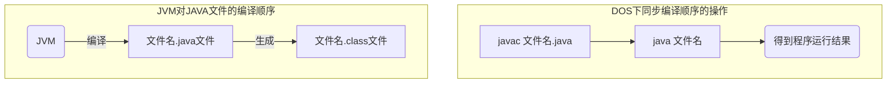
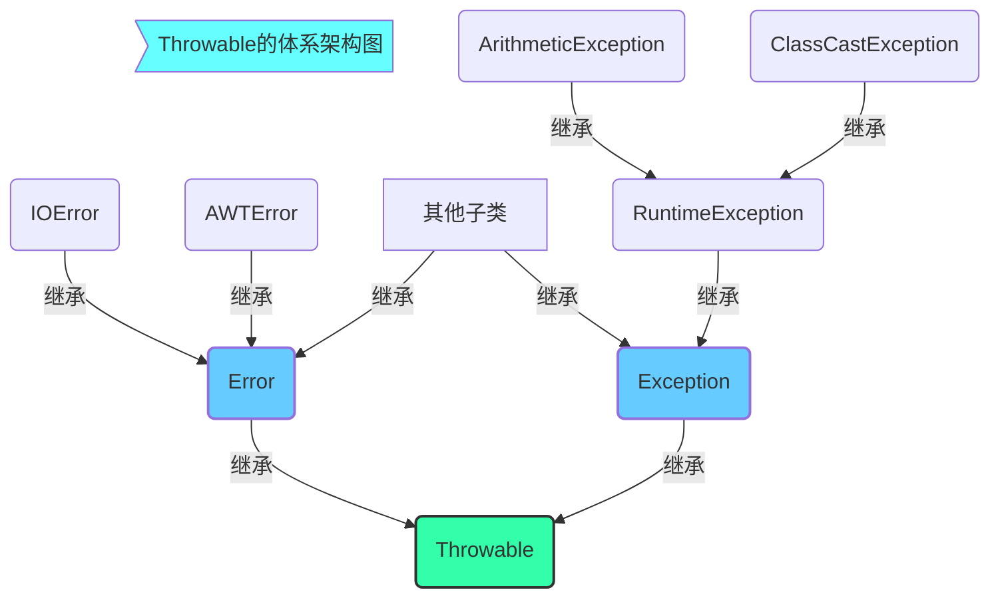

## Java基础——笔记要点（一）

### Java编程基础要点记录

#### 1、在dos环境下运行java程序

这里需要注意path和classpath的区别，同时要熟悉dos中setpath和setclasspath的区别。其次，在dos下进行java编程时，要注意JVM对java文件的编译顺序。



**注意**：这里编译到.class后，通过java命令运行程序时不需要加后缀

#### 2、Java中的文档注释

文档注释是以`/**`开头，以`*/`结束。这里可使用javadoc命令将文档提取出来生成帮助文档。

#### 3、自动类型转换

**满足条件**：

1、两种数据类型兼容。2、目标类型取值范围大于源类型的取值范围。

#### 4、运算符

+ `~`运算符——按位取反
+ `>>>`运算符——无符号右移

+ `&`与`&&`的区别：一个是与运算，另一个是短路与，在进行条件判断时两者会有显著的区别。

#### 5、随机数生成

Random类有两个构造方法，无参的构造方法在使用时系统会使用当前时间戳作为随机数的种子进行随机数生成；有参的构造方法需要给伪随机数生成器传入一个随机数种子，用来生成有相同序列的随机数。

**注意**：

+ Math类中的random方法用来生成0.0~1.0的随机数，Random类可生成不同类型的随机数（如：整型nextInt、布尔类型nextBoolean等）。
+ 使用如nextInt(n)方法生成随机数时，随机数包括0但不包括n，生成其他类型的也是如此。

Random类中的nextInt()方法用来生成随机的整数，例如：

```java
Random random=new Random.nextInt(10); //生成0~9以内的随机数
```

#### 6、Java中的垃圾回收机制

Java中的垃圾回收机制由JVM自动进行，还可以使用`System.gc()`方法通知JVM立即进行垃圾回收，期间会自动调用finalize()方法，可在类中定义finalize()方法观察对象何时被释放。

#### 7、关键字instanceof

利用关键字instanceof判断对象是否为某个类的实例或子类实例，语法格式如下：

```
对象(或对象引用变量) instanceof 类(接口)
```

如：`if(animal instanceof Cat)`判断animal是否是Cat类的实例对象

#### 8、Object类

Object类中的**常用方法**

|   方法名   |                说明                |
| :--------: | :--------------------------------: |
|  equals()  | 指示其他某个对象是否与此对象"相等" |
| getClass() |       返回此Object的运行时类       |
| hashCode() |        返回该对象的哈希码值        |
| toString() |       返回该对象的字符串表示       |

**注意**：这里的`toString()`方法等价于`getClass().getName()+"@"+Integer.toHexString(hashCode())`，代码解释如下

|             方法名              |                        解释                         |
| :-----------------------------: | :-------------------------------------------------: |
|      getClass().getName()       |                 返回对象所属的类名                  |
| Integer.toHexString(hashCode()) |            将对象的哈希值用十六进制表示             |
|           hashCode()            | 将对象的内存地址进行哈希运算，返回一个int型的哈希值 |

#### 9、异常

在java中提供了大量的异常类，这些类都继承自java.lang.Throwable类

Throwable的体系架构图如下



这里的Error类代表程序中产生的错误，表示java运行时产生的系统内部错误或资源耗尽的错误；Exception类代表程序中产生的异常，表示程序本身可以处理的错误，在Exception类下面的RuntimeException类和它的子类都表示运行时异常，除此之外的类表示编译时异常。

Throwable的常用方法如下：

|               方法名                |                  描述                   |
| :---------------------------------: | :-------------------------------------: |
|         String getMessage()         |    返回此throwable的详细消息的字符串    |
|       void printStackTrace()        |  将此throwable及其追踪输出至标准错误流  |
| void printStackTrace(PrintStream s) | 将此throwable及其追踪输出到指定的输出流 |

#### 10、String类的常见操作

String类的常用方法：

|                      方法名                       |                             描述                             |
| :-----------------------------------------------: | :----------------------------------------------------------: |
|                     indexOf()                     | 返回指定字符在此字符串中第一次出现的索引（可指定单个字符或子字符串） |
|                   lastIndexOf()                   | 返回指定字符在此字符串中最后一次出现的索引（可指定单个字符或子字符串） |
|                     charAt()                      |               根据索引返回指定索引位置上的字符               |
|                     length()                      |                       返回字符串的长度                       |
|                   toLowerCase()                   |                   将指定的字符串转换为小写                   |
|                   toUpperCase()                   |                   将指定的字符串转换为大写                   |
|           static String valueOf(int i)            |                返回int型参数的字符串表示形式                 |
|                   toCharArray()                   |                   将此字符串转换为字符数组                   |
| replace(CharSequence oldstr, CharSequence newstr) |        在该字符串中，用newstr替换oldstr并返回一个新串        |
|                      split()                      | 将该字符串按指定的分隔符分成若干个字串，返回值是一个字符串数组 |
|             substring(int beginIndex)             |           返回从指定位置开始到字符串末尾的所有字符           |
|      substring(int beginIndex,int endIndex)       |        返回从指定开始位置到指定末尾位置-1处的所有字符        |
|                      trim()                       |          返回一个当前字符串去除首尾空格后的新字符串          |
|                   startsWith()                    |   判断字符串是否以指定的字符串开始（返回值为boolean类型）    |
|                    contains()                     |   判断字符串是否包含指定的字符序列（返回值为boolean类型）    |
|                    endsWith()                     |    判断该字符串是否以指定字符结尾（返回值为boolean类型）     |
|                     equals()                      |    将此字符串与指定字符串进行比较（返回值为boolean类型）     |
|                     isEmpty()                     |       当字符串长度为0时返回true（返回值为boolean类型）       |

**注意**：当使用charAt()方法访问字符串时，若超出字符串范围会出现字符串角标越界异常（StringIndexOutOfBoundsException）

#### 11、StringBuffer类的常见操作

StringBuffer类与String类的区别：内容及长度可以改变、当进行添加或删除操作时并不会产生新的StringBuffer对象。

StringBuffer类常用方法

|     方法名     |                          描述                          |
| :------------: | :----------------------------------------------------: |
|    append()    | 添加参数到StringBuffer对象中去（可添加任何类型的参数） |
|    insert()    |    指定位置插入任何类型的参数到StringBuffer对象中去    |
|    delete()    |    删除StringBuffer对象中指定范围的字符或字符串序列    |
| deleteCharAt() |                   删除指定位置的参数                   |
|  setCharAt()   |                  修改指定位置处的字符                  |
|   replace()    |                  修改指定范围的字符串                  |
|   toString()   |                   返回缓冲区的字符串                   |
|   reverse()    |           将缓冲区的字符序列用其反转形式取代           |

#### 12、System类的常用方法

System类定义的一些方法和系统有关，它所提供的属性和方法都是静态的，常用的一些方法如下：

|         方法名          |                           描述                           |
| :---------------------: | :------------------------------------------------------: |
|         exit()          |           用于终止当前正在运行的JVM，如exit(1)           |
|          gc()           |              运行垃圾回收器，对垃圾进行回收              |
|   currentTimeMillis()   |                返回以毫秒为单位的当前时间                |
|       arraycopy()       | 将源数组复制到引用的数组（从指定位置开始到目标位置结束） |
|     getProperties()     |                    取得当前系统的属性                    |
| getProperty(String key) |                 获取指定键描述的系统属性                 |

#### 13、Runtime类

该类表示虚拟机运行时的状态，用于封装JVM虚拟机进程，该类采用**单例模式**进行设计，对象不可直接实例化。获得该类的一个实例，需要通过`Runtime runtime = Runtime.getRuntime();`方式获取实例化对象，常用的一些方法如下：

|        方法名         |               描述                |
| :-------------------: | :-------------------------------: |
| availableProcessors() |         获取处理器的个数          |
|     freeMemory()      |    获取空闲内存数量（字节级）     |
|      maxMemory()      |    获取最大内存数量（字节级）     |
|        exec()         | 通过该命令在java程序中执行dos命令 |

#### 14、Integer类

该类属于Java包装类中的一类，统一继承Object类，Integer类的常用方法如下：

|      方法名      |                             描述                             |
| :--------------: | :----------------------------------------------------------: |
| toBinaryString() |             返回一个二进制无符号整数参数的字符串             |
|  toHexString()   |            返回一个十六进制无符号整数参数的字符串            |
| toOctalString()  |             返回一个八进制无符号整数参数的字符串             |
|    valueOf()     |       返回一个指定值的实例或对象（可指定int或string）        |
|    parseInt()    | 将字符串参数作为一个有符号的十进制整数进行解析（将字符串转换为整数） |
|    intValue()    |              将Integer类型的值以int类型进行返回              |


### 问题

+ path环境变量的作用[^1]
+ JVM（JAVA虚拟机的相关知识）[^2]
+ &与&&的区别[^3]
+ break、continue与return的区别[^4]
+ this关键字[^5]
+ String类和StringBuffer类的区别[^6]

### 技巧/拓展

1、对多层嵌套循环问题可将其对应多维坐标空间中的点进行理解。

2、利用delete函数清空缓冲区，用法：`缓冲区名称.delete(0,缓冲区名称.length());`

3、在程序开始和程序结束时分别调用一次currentTimeMillis()方法，将程序结束时获取到的时间戳与程序开始时获取到的时间戳相减即可得到程序运行的时间。（毫秒级）

4、exec方法返回的是一个Process对象，该对象表示操作系统的一个进程，若要实现关闭进程可利用Process对象的destroy方法实现关闭功能。

5、装箱：将基本数据类型的值转为引用数据类型；拆箱：将引用数据类型的对象转为基本数据类型。这里在Java包装类中和C#中很常见。

6、Arrays类中的sort()方法可以对数组进行由小到大的排序。

*****

[^1]: 指定命令搜索路径，设置好PATH变量后，就可以在任何目录下执行该软件的dos命令。
[^2]: JVM是Java Virtual Machine（Java虚拟机）的缩写，JVM是一种用于计算设备的规范，它是一个虚构出来的计算机，是通过在实际的计算机上仿真模拟各种计算机功能来实现的。
[^3]: 在java中，&是与运算，&&是短路与，在进行条件判断时&与运算无论左边的表达式的结果为何值右边的表达式都会执行，而&&短路与当左边的表达式的值为假时右边的表达式将不再执行。
[^4]: break跳出循环时将不再执行后续的循环，continue跳出循环时只跳出本次循环后续的循环还会发生，return用来返回结果或表达式的值通常用在有返回值的函数中。
[^5]: this关键字当该程序中出现两种有相同的变量名的定义时，利用this关键字可以指定程序在此时使用的变量是哪一个。如在构造函数中使用this关键字用来指定这时使用的变量是类中的全局变量。
[^6]: StringBuffer内容及长度可以改变，当进行添加或删除操作时并不会产生新的StringBuffer对象，而String恰恰相反。