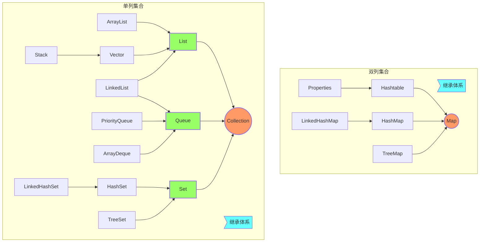
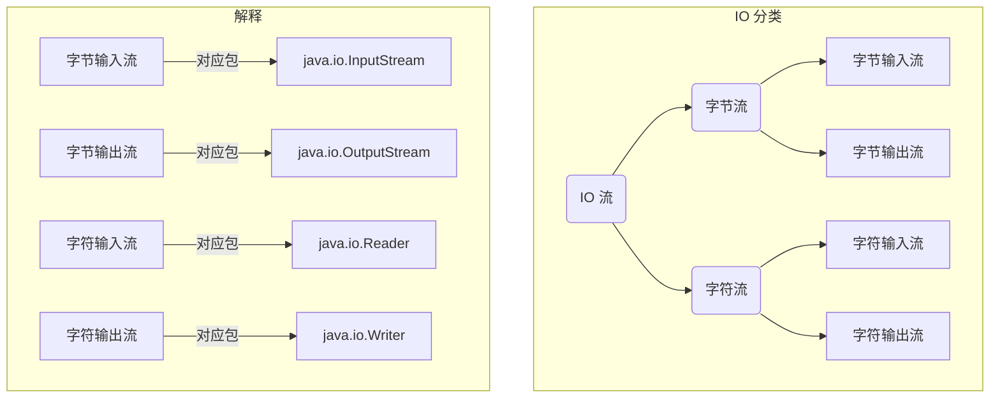
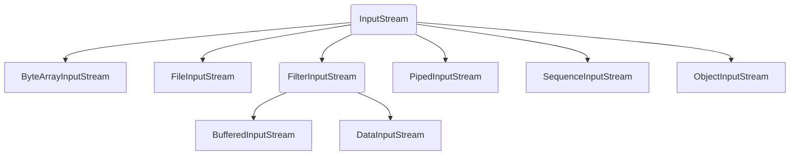
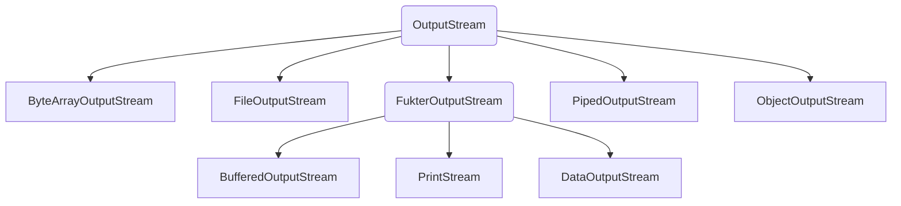
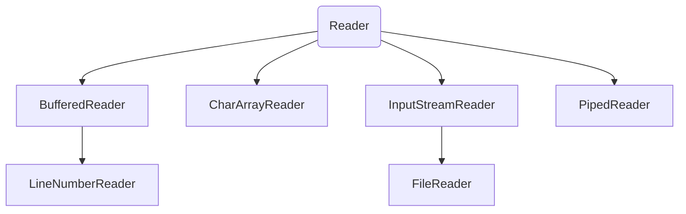
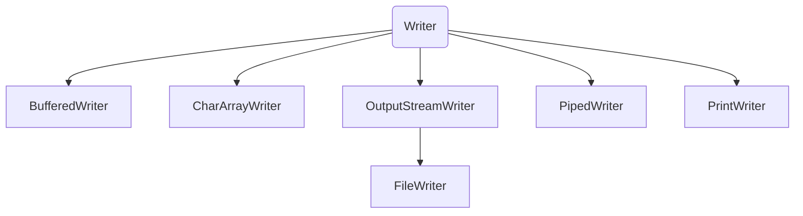
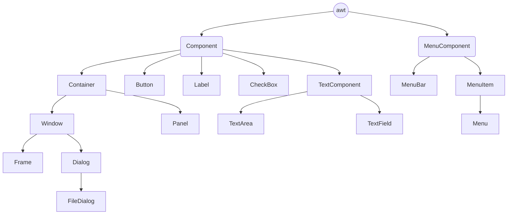
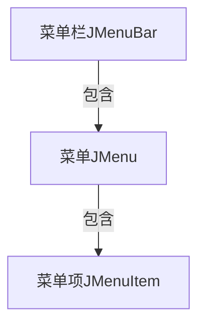

## Java基础——笔记要点（二）

### Java编程基础要点记录

#### 1、String类的concat()方法

concat()方法用于将指定的字符串与旧串连接起来，例如：`String a="A";System.out.print(a.concat("B"));`这时会输出AB，与字符串相加类似。

#### 2、StringTokenizer类

该类属于Java.util包，用来分隔字符串。

##### （1）常用构造方法

|                            方法名                            |                             描述                             |
| :----------------------------------------------------------: | :----------------------------------------------------------: |
|               **StringTokenizer(String str)**                | 创建一个用来解析 str 的 StringTokenizer 对象。使用java 默认的分隔符（空格("")、制表符(\t)、换行符(\n)、回车符(\r)）分隔str。 |
|        **StringTokenizer(String str, String delim)**         | 构造一个用来解析 str 的 StringTokenizer 对象，用指定的分隔符delim分隔str |
| **StringTokenizer(String str, String delim, boolean returnDelims)** | 构造一个用来解析 str 的 StringTokenizer 对象，用指定的分隔符delim分隔str，同时，指定是否返回分隔符。 |

##### （2）常用方法

|               方法名               |                    描述                     |
| :--------------------------------: | :-----------------------------------------: |
|       **int countTokens()**        |        返回nextToken方法被调用的次数        |
|    **boolean hasMoreTokens()**     |             返回是否还有分隔符              |
|   **boolean hasMoreElements()**    | 判断枚举 （Enumeration） 对象中是否还有数据 |
|       **String nextToken()**       |    返回从当前位置到下一个分隔符的字符串     |
|      **Object nextElement()**      |  返回枚举 （Enumeration） 对象的下一个元素  |
| **String nextToken(String delim)** |  与nextToken()类似，以指定的分隔符返回结果  |


#### 3、集合类

**定义**：集合类是JDK中的一种特殊的类，可以存储任意类型的对象，且长度可变。

**体系架构**如下：



**特点**：Collection是单列集合的根接口，用来存储一系列符合某种规则的元素，它有两个重要的子接口List和Set。List的特点是元素有序可重复（存入顺序和取出顺序一致），Set的特点是元素无序不可重复。Map是双列集合的根接口，用来存储具有键、值映射关系的元素，每个元素都包含一对键值。

注意：在使用Set方法时，需要重写equals方法和hashCode方法，

##### （1）Collection接口的常用方法

如下所示的方法可以操作所有的单列集合

|    方法名     |                    描述                    |                返回值                |
| :-----------: | :----------------------------------------: | :----------------------------------: |
|     add()     |            向集合中添加一个元素            |               布尔类型               |
|   addAll()    | 将指定Collection中的所有元素添加到该集合中 |               布尔类型               |
|   remove()    |           删除该集合中的指定元素           |               布尔类型               |
|  removeAll()  |          删除指定集合中的所有元素          |               布尔类型               |
|   isEmpty()   |             判断该集合是否为空             |               布尔类型               |
|  contains()   |         判断该集合是否包含某个元素         |               布尔类型               |
| containsAll() |    判断该集合是否包含指定集合的所有元素    |               布尔类型               |
|    clear()    |            删除该集合的所有元素            |                 void                 |
|  iterator()   |             遍历该集合所有元素             | 返回在该集合的元素上进行迭代的迭代器 |
|    size()     |             获取该集合元素个数             |                 int                  |

##### （2）List接口的常用方法

如下所示的方法，有些继承了Collection接口的方法且增加了根据元素索引操作集合的特有方法

|    方法名     |                             描述                             |  返回值  |
| :-----------: | :----------------------------------------------------------: | :------: |
|     add()     |             将指定元素插入到List集合的指定索引处             |   void   |
|   addAll()    |     将指定集合所包含的所有元素插入到List集合的指定索引处     | 布尔类型 |
|   indexOf()   |              返回对象在List集合中出现的位置索引              |   int    |
| lastIndexOf() |          返回对象在List集合中最后一次出现的位置索引          |   int    |
|   subList()   | 返回指定索引范围处的所有元素集合组成的子集合（末尾元素不包括） |   List   |
|     get()     |                     返回集合索引处的元素                     |  Object  |
|   remove()    |                     删除指定索引处的元素                     |  Object  |
|     set()     |    将指定索引处的元素替换成指定的对象，将替换后的元素返回    |  Object  |

**优劣分析**：查询效率高，但不适合增删操作。

##### （3）LinkedList接口的常用方法

|    方法名     |               描述               | 返回值 |
| :-----------: | :------------------------------: | :----: |
|     add()     | 在此列表中的指定位置插入指定元素 |  void  |
|  addFirst()   |     将指定元素插入到列表开头     |  void  |
|   addLast()   |    将指定元素添加到列表的结尾    |  void  |
|  getFirst()   |      返回此列表的第一个元素      | Object |
|   getLast()   |     返回此列表的最后一个元素     | Object |
| removeFirst() |   移除并返回此列表的第一个元素   | Object |
| removeLast()  |  移除并返回此列表的最后一个元素  | Object |

**优劣分析**：增删元素效率高

##### （4）Map接口的常用方法

Map接口是一种双列集合，它的每个元素都包含一个键对象和值对象，键值之间存在一种对应关系称为映射。如下所示的方法是Map接口的一些常用方法

|            方法名             |                             描述                             |   返回值   |
| :---------------------------: | :----------------------------------------------------------: | :--------: |
|             put()             |                   将指定的值与指定的键关联                   |    void    |
|             get()             | 返回指定键所映射的值，若该映射不包含该键的映射关系，则返回null | Object对象 |
|           keySet()            |                返回此映射中包含的键的Set视图                 |    Set     |
| Set<Map.Entry<K,V>>entrySet() |             返回此映射中包含的映射关系的Set视图              |    Set     |
|            value()            |             返回此映射中包含的值的Collection视图             | Collection |
|         containsKey()         |              判断此映射是否包含指定键的映射关系              |  布尔类型  |
|        containsValue()        |        若此映射将一个或多个键映射到指定值，则返回true        |  布尔类型  |

**特点**：键相同，值覆盖。键具有唯一性。

注意：Hashtable是线程安全的，但存取元素时的速度很慢。与HashMap十分相似，但几乎被HashMap取代。

##### （5）Properties集合

定义：主要用来存储字符串类型的值和键，实际开发中用它来存储应用的配置项。

方法：setProperty()方法用于将配置项的键和值添加到Properties集合中，getProperty()方法用来获得键所对应的值。

#### 4、StringBuilder类

##### （1）StringBuffer类和StringBuilder的区别

当对字符串进行修改的时候，需要使用 StringBuffer 和 StringBuilder 类。和 String 类不同的是，StringBuffer 和 StringBuilder 类的对象能够被多次的修改，并且不产生新的未使用对象。StringBuilder类和 StringBuffer之间的最大不同在于 StringBuilder 的方法不是线程安全的（不能同步访问）。由于 StringBuilder 相较于 StringBuffer 有速度优势，所以多数情况下建议使用 StringBuilder 类。然而在应用程序要求线程安全的情况下，则必须使用 StringBuffer 类。常用方法与StringBuffer类似。

#### 5、DateFormat类

DateFormat 是(日期/时间)格式化子类的抽象类，它以与语言无关的方式格式化并解析日期或时间。(日期/时间)格式化子类（如 SimpleDateFormat）允许进行格式化（也就是日期→文本）、解析（文本→日期）和标准化日期。

它在创建对象时，不能用new关键字，而应该使用DateFormat类中的静态方法getDateInstance()，例如：`DateFormat df = DateFormat.getDatelnstance();`。

##### （1）常用方法

|                            方法名                            |                             描述                             |
| :----------------------------------------------------------: | :----------------------------------------------------------: |
|                   String format(Date date)                   |               将 Date 格式化为日期/时间字符串                |
|                    Calendar getCalendar()                    |              获取与此日期/时间格式相关联的日历               |
|             static DateFormat getDateInstance()              |        获取具有默认格式化风格和默认语言环境的日期格式        |
|         static DateFormat getDateInstance(int style)         |        获取具有指定格式化风格和默认语言环境的日期格式        |
|  static DateFormat getDateInstance(int style,Locale locale)  |        获取具有指定格式化风格和指定语言环境的日期格式        |
|           static DateFormat getDateTimeInstance()            |     获取具有默认格式化风格和默认语言环境的日期/时间格式      |
| static DateFormat getDateTimeInstance(int dateStyle,int timeStyle) | 获取具有指定日期/时间格式化风格和默认语言环境的日期/时间格式 |
| static DateFormat getDateTimeInstance(int dateStyle,int timeStyle,Locale locale) | 获取具有指定日期/时间格式化风格和指定语言环境的日期/时间格式 |
|             static DateFormat getTimeInstance()              |        获取具有默认格式化风格和默认语言环境的时间格式        |
|         static DateFormat getTimeInstance(int style)         |        获取具有默认格式化风格和默认语言环境的时间格式        |
|  static DateFormat getTimeInstance(int style,Locale locale)  |        获取具有默认格式化风格和默认语言环境的时间格式        |
|            void setCalendar(Calendar newCalendar)            |                       为此格式设置日历                       |
|                  Date parse(String source)                   |                将给定的字符串解析成日期/时间                 |

通过设置DateFormat 类的常量来格式化时间样式，常量如下：

SHORT：完全为数字；MEDIUM：较长，如 May 10，2016；LONG：更长，如 May 12，2016 或 11:15:32am；FULL：是完全指定，如 Tuesday、May 10、2012 AD 或 11:l5:42am CST；

#### 6、IO流分类

java中IO流有很多种，按照操作顺序的不同可以分为字节流和字符流；按照传输方向的不同可以分为输入流和输出流。具体分类如下：



##### （1）字节流

###### InputStream的常用方法

|               方法名               |                             描述                             |
| :--------------------------------: | :----------------------------------------------------------: |
|             int read()             | 从输入流读取一个8位的字节，把它转换为0~255之间的整数，并返回这一个整数 |
|         int read(byte[] b)         | 从输入流读取若干字节，把它们保存到参数b指定的字节数组中，返回的整数表示读取字节的数目 |
| int read(byte[] b,int off,int len) | 从输入流读取若干字节，把它们保存到参数b指定的字节数组中，off指定字节数组开始保存数据的起始下标，len表示读取的字节数目 |
|            void close()            |                     关闭输入流并释放资源                     |

###### OutputStream的常用方法

|                方法名                |                          解释                          |
| :----------------------------------: | :----------------------------------------------------: |
|          void write(int b)           |                  向输出流写入一个字节                  |
|         void write(byte[] b)         |       把参数b指定的字节数组的所有字节写到输出流        |
| void write(byte[] b,int off,int len) | 将指定的byte数组中从偏移量off开始的len个字节写入输出流 |
|             void flush()             |        刷新此输出流并强制写出所有缓冲的输出字节        |
|             void close()             |       关闭此输出流并释放与此流相关的所有系统资源       |

###### InputStream的子类体系



###### OutputStream的子类体系



##### （2）字符流

###### Reader的子类体系



###### Writer的子类体系



**注意：**InputStreamReader、OutputStreamWriter是转换流，可以将字节流转换为字符流，使用转换流时只能针对文本文件，其他文件可能会造成数据丢失。

#### 7、File类

##### （1）File类常用的构造方法

|              方法名              |                         描述                         |
| :------------------------------: | :--------------------------------------------------: |
|      File(String pathname)       |  指定一个字符串类型的文件路径来创建一个新的File对象  |
| File(String parent,String child) | 根据指定的一个字符串类型的父路径和子路径创建File对象 |
|  File(File parent,String child)  |   根据指定的一个File类的父路径和子路径创建File对象   |

##### （2）File类的常用方法

|      方法名       |                            描述                             |
| :---------------: | :---------------------------------------------------------: |
|     exists()      | 判断File对象对应的文件或目录是否存在，存在true，不存在false |
|     delete()      |     删除File对象对应的文件或目录，若成功删除则返回true      |
|  createNewFile()  |    创建一个此File对象所指定的新文件，若创建成功返回true     |
|     getName()     |            返回File对象表示的文件或文件夹的名称             |
|     getPath()     |                   返回File对象对应的路径                    |
| getAbsolutePath() |                 返回File对象对应的绝对路径                  |
|    getParent()    |                返回File对象对应目录的父目录                 |
|     canRead()     |    判断File对象对应的文件或目录是否可读，可读则返回true     |
|    canWrite()     |    判断File对象对应的文件或目录是否可写，可写则返回true     |
|     isFile()      |       判断File对象对应的是否是文件，是文件则返回true        |
|   isDirectory()   |       判断File对象对应的是否是目录，是目录则返回true        |
|   isAbsolute()    |         判断File对象对应的文件或目录是否是绝对路径          |
|  lastModified()   |     返回1970年1月1日0时0分0秒到文件最后修改时间的毫秒值     |
|     length()      |                     返回文件内容的长度                      |
|      list()       |            列出指定目录的全部内容，只是列出名称             |
|    listFiles()    |     返回一个包含了File对象所有子文件和子目录的File数组      |

**注意：**使用list方法时，如果想获取指定目录下的所有".java"文件，可以使用list的重载的list(FilenameFilter filter)方法。核心要点在于接口FilenameFilter中的抽象方法accept(File dir,String name)。

#### 8、AWT

##### （1）AWT的子类体系



##### （2）布局管理器

###### FlowLayout——流式布局管理器

**特点**：在这种布局下，容器会将组件按照添加顺序从左向右布置，并会自动换行。

**构造方法：**

|                 方法名                  |                          描述                           |
| :-------------------------------------: | :-----------------------------------------------------: |
|              FlowLayout()               |      组件默认居中对齐，水平、垂直间距默认为5个单位      |
|          FlowLayout(int align)          | 指定组件相对容器的对齐方式，水平、垂直间距默认为5个单位 |
| FlowLayout(int align,int hgap,int vgap) |           指定组件的对齐方式和水平、垂直间距            |

**注意**：对齐方式：FlowLayout.LEFT—左对齐  FlowLayout.RIGHT—右对齐  FlowLayout.CENTER—居中对齐

###### BorderLayout——边界布局管理器

**特点：**该布局方式将界面划分为五个区域，分别是东（EAST）南（SOUTH）西（WEST）北（NORTH）中（CENTER）

**注意：**当改变容器大小时，NORTH和SOUTH区域高度不变，长度调整，WEST和EAST区域宽度不变，高度调整，CENTER会进行相应调整。当添加组件时，使用add(Component comp,Object constraints)方法。其中comp代表添加的组件，constraints指定将组件添加到布局中的方式和位置的对象。Frame容器默认使用该布局方式。

###### GridLayout——网格布局管理器

**特点：**这种布局方式使用纵横线将容器分成n行m列大小相等的网格，每个网格中放置一个组件。添加到容器中的组件首先放置在第一行第一列，当一行放置满后会自动换行。

**构造方法：**

|                     方法名                      |                       描述                       |
| :---------------------------------------------: | :----------------------------------------------: |
|                  GridLayout()                   |           默认只有一行，每个组件占一列           |
|          GridLayout(int rows,int cols)          |               指定容器的行数和列数               |
| GridLayout(int rows,int cols,int hgap,int vgap) | 指定容器的行数和列数以及组件之间的水平、垂直间距 |

**注意：**该布局方式，所有组件的宽高都相同。在进行缩放时，相对位置不变，大小会随之改变。

###### GridBagLayout——网格包布局管理器

**特点：**与GridLayout大体相同，不同之处在于它允许网格中的组件大小各不相同，允许一个组件跨越一个或多个网格。

**使用步骤：**

第一步：创建GridBagLayout布局管理器，使容器采用该布局方式。

```java
GridBagLayout layout=new GridBagLayout();
container.setLayout(layout);
```

第二步：创建GridBagContraints对象，并设置该对象的属性。

```java
GridBagConstraints constraints=new GridBagConstraints();
constraints.gridx=1;//设置网格的左上角横向索引
constraints.gridy=1;//设置网格的左上角纵向索引
constraints.gridwidth=1;//设置组件横向跨越的网格
constraints.gridheight=1;//设置组件纵向跨越的网格
```

第三步：调用GridBagLayout对象的setConstraints()方法建立GridBagContraints对象和受控组件之间的关联。

```java
layout.setConstraints(component,constraints);
```

第四步：向容器中添加组件

```java
contrainer.add(conponent);
```

###### CardLayout——卡片布局管理器

**特点：**该布局方式将界面看作是一系列卡片，在任何时候只有其中的一张卡片是可见的，这张卡片占据容器的整个区域。

**常用方法：**

|               方法名               |                            描述                            |
| :--------------------------------: | :--------------------------------------------------------: |
|      first(Container parent)       |                 显示parent容器的第一张卡片                 |
|       last(Container parent)       |                显示parent容器的最后一张卡片                |
|     previous(Container parent)     |                 显示parent容器的前一张卡片                 |
|       next(Container parent)       |                 显示parent容器的下一张卡片                 |
| show(Container parent,String name) | 显示parent容器中名称为name的组件，若不存在不会发生任何操作 |

##### （3）AWT绘图

在java.awt包中提供了Graphics类，使用该类的方法就可以实现在组件上绘制图型。

**常用方法：**

|                   方法名                   |                             描述                             |
| :----------------------------------------: | :----------------------------------------------------------: |
|             setColor(Color c)              |              设置图形上下文的当前颜色为指定颜色              |
|              setFont(Font f)               |                设置图形上下文的字体为指定字体                |
|   drawLine(int x1,int y1,int x2,int y2)    |             以(x1,y1)和(x2,y2)为端点绘制一条线段             |
| drawRect(int x,int y,int width,int height) | 绘制指定矩形的边框，矩形的左边缘和右边缘分别位于x和x+width，上边缘和下边缘位于y和y+height |
| drawOval(int x,int y,int width,int height) | 绘制椭圆的边框，得到一个圆或椭圆，它正好能放入由各个参数指定的矩形中。椭圆覆盖区域的宽度为width+1像素，高度为height+1像素 |
| fillRect(int x,int y,int width,int height) | 用当前颜色填充指定的矩形。矩形左边缘和右边缘位于x和x+width-1，上边缘和下边缘分别位于y和y+height-1 |
| fillOval(int x,int y,int width,int height) |              用当前颜色填充外接指定矩形框的椭圆              |
|     drawString(String str,int x,int y)     | 使用此图形上下文的当前字体和颜色绘制指定的文本str。最左侧字符左下角位于(x,y)坐标 |

**注意：**字体样式的三个常量：PLAINT、ITALIC、BOLD

#### 9、Swing

##### （1）JDialog

模态对话框：用户在处理完对话框后才能与其他窗体交互

非模态对话框：允许用户在处理对话框的同时与其他窗口交互

对话框的模态或非模态，可以在创建JDialog对象时为构造方法传入参数设置，也可以在创建JDialog对象后调用它的setModal()方法来设置。

###### 常见的构造方法

|               方法名               |                             描述                             |
| :--------------------------------: | :----------------------------------------------------------: |
|        JDialog(Frame owner)        |                  用来创建一个非模态的对话框                  |
| JDialog(Frame owner,String title)  |              创建一个具有指定标题的非模态对话框              |
| JDialog(Frame owner,boolean modal) | 创建一个有指定模式的无标题对话框，modal为true创建模态对话框，默认值为false |

##### （2）JFrame和Frame的区别

JFrame和Frame的区别在于JFrame提供了关闭窗口的功能，只需要调用如下方法传入参数值即可。

```java
this.setDefaultCloseOperation(JFrame.EXIT_ON_CLOSE);
```

##### （3）中间容器

顶级窗口：JFrame、JDialog

中间容器不能单独存在，只能放在顶级窗口中，最常见的顶级容器为JPanel和JScrollPane，JScrollPane是一个带有滚动条的面板容器，该面板只能添加一个组件，若想添加多个组件时，应先将JScrollPane添加到JPanel中。

###### JScrollPane的构造方法

|                         方法名                          |                             描述                             |
| :-----------------------------------------------------: | :----------------------------------------------------------: |
|                      JScrollPane()                      |                 创建一个空的JScrollPane面板                  |
|               JScrollPane(Component view)               |            创建一个显示指定组件的JScrollPane面板             |
| JScrollPane(Component view,int vsbPolicy,int hsbPolicy) | 创建一个显示指定容器并具有指定滚动条策略的JScrollPane面板。参数vsbPolicy和hsbPolicy表示垂直滚动条策略和水平滚动条策略，应指定为静态常量：HORIZONTAL_SCROLLBAR_AS_NEEDED表示需要时显示，默认策略。HORIZONTAL_SCROLLBAR_NEVER表示永久不显示。HORIZONTAL_SCROLLBAR_ALWAYS表示一直显示 |

###### JScrollPane的方法

|               方法名               |           描述           |
| :--------------------------------: | :----------------------: |
| setHorizontalBarPolicy(int policy) |    指定水平滚动条策略    |
|  setVerticalBarPolicy(int policy)  |    指定垂直滚动条策略    |
|  setViewportView(Component view)   | 设置在滚动面板显示的组件 |

##### （4）文本组件

###### JTextComponent 常用方法

|              方法名              |                描述                |
| :------------------------------: | :--------------------------------: |
|            getText()             |    返回文本组件中所有的文本内容    |
|        getSelectedText()         |    返回文本组件中选定的文本内容    |
|           selectAll()            |      在文本组件中选中所有内容      |
|          setEditable()           | 设置文本组件为可编辑或不可编辑状态 |
|       setText(String text)       |         设置文本组件的内容         |
| replaceSelection(String content) |   用给定的内容替换当前选定的内容   |

###### JTextField 构造方法

JTextField：只能接收单行文本的输入，它的子类JPasswordText表示密码框

|               方法名               |                       描述                       |
| :--------------------------------: | :----------------------------------------------: |
|            JTextField()            |       创建一个空的文本框，初始字符串为null       |
|      JTextField(int columns)       |  创建一个具有指定列数的文本框，初始字符串为null  |
|      JTextField(String text)       |        创建一个显示指定初始字符串的文本框        |
| JTextField(String text,int column) | 创建一个具有指定列数并显示指定初始字符串的文本框 |

###### JTextArea 构造方法

JTextArea：文本域，可以接收多行文本的输入

|                   方法名                    |                描述                |
| :-----------------------------------------: | :--------------------------------: |
|                 JTextArea()                 |         创建一个空的文本域         |
|           JTextArea(String text)            |   创建显示指定初始字符串的文本域   |
|       JTextArea(int rows,int columns)       |     创建具有指定行和列的文本域     |
| JTextArea(String text,int rows,int columns) | 创建显示指定初始文本和行列的文本域 |

##### （5）按钮组件

###### 常用方法

Swing中常见的按钮组件有JButton、JCheckBox、JRadioButton等，它们都是抽象类AbstractButton类的子类，抽象类AbstractButton的常用方法如下：

|                   方法名                    |               描述               |
| :-----------------------------------------: | :------------------------------: |
|   Icon getIcon()与void setIcon(Icon icon)   |        设置或获取按钮图标        |
| String getText()与void setText(String text) |        设置或获取按钮文本        |
|          void setEnable(boolean b)          |          启用或禁用按钮          |
|           setSelected(boolean b)            | 设置按钮的状态，true代表选中状态 |
|            boolean isSelected()             |    返回按钮的状态(true为选中)    |

###### JCheckBox（复选框）构造方法

|                 方法名                  |                     描述                     |
| :-------------------------------------: | :------------------------------------------: |
|               JCheckBox()               | 创建一个没有文本信息，初始状态未选中的复选框 |
|         JCheckBox(String text)          | 创建一个含有文本信息，初始状态未选中的复选框 |
| JCheckBox(String text,boolean selected) | 创建一个含有文本信息，可指定初始状态的复选框 |

###### JRadionButton（单选框）构造方法

|                   方法名                    |                      描述                      |
| :-----------------------------------------: | :--------------------------------------------: |
|               JRadionButton()               | 创建一个没有文本信息，初始状态未被选中的单选框 |
|         JRadionButton(String text)          | 创建一个带有文本信息，初始状态未被选中的单选框 |
| JRadionButton(String text,boolean selected) | 创建一个带有文本信息，可以指定初始状态的单选框 |

**注意：**JRadionButton不具备按钮间的互斥，若实现互斥需要使用`javax.swing.ButtonGroup`包中的ButtonGroup类，将单选按钮组件组成一组。

###### JComboBox（组合框）构造方法

|          方法名           |                             描述                             |
| :-----------------------: | :----------------------------------------------------------: |
|        JComboBox()        |                  创建一个没有可选项的组合框                  |
| JComboBox(Object[] items) | 创建一个组合框，将Object数组中的元素作为组合框的下拉列表选项 |
|  JComboBox(Vector items)  | 创建一个组合框，将Vector集合中的元素作为组合框的下拉列表选项 |

###### JComboBox 常用方法

|                    方法名                    |                  描述                   |
| :------------------------------------------: | :-------------------------------------: |
|        void addItem(Object anObject)         |            为组合框添加选项             |
| void insertItemAt(Object anObject,int index) |          在指定索引处添加选项           |
|         Object getItemAt(int index)          | 返回指定索引处选项，第一个选项的索引为0 |
|              int getItemCount()              |         返回组合框中选项的数目          |
|           Object getSelectedItem()           |             返回当前所选项              |
|            void removeAllItems()             |         删除组合框中的所有选项          |
|        void removeItem(Object object)        |              删除指定选项               |
|         void removeItemAt(int index)         |          删除指定索引处的选项           |
|       void setEditable(boolean aFlag)        |       设置组合框的选项是否可编辑        |

##### （6）菜单组件

###### 下拉式菜单

创建下拉式菜单需要用到三个组件：JMenuBar（菜单栏）、JMenu（菜单）、JMenuItem（菜单项），这三个的布局关系如下图所示



JMenuBar：菜单栏的布局位置可以放在任何位置，通常会使用顶级容器的`setJMenuBar(JMenuBar menubar)`方法放在顶级容器的顶部，创建完菜单后可以调用它的add(JMenu c)方法为其添加JMenu菜单。

JMenu：代表一个菜单，用来整合管理菜单项。菜单结构可以是多层次的也可以是单一结构的。多数情况下使用构造方法`JMenu(String text)`方法创建JMenu菜单。

JMenuItem：代表一个菜单项，创建菜单项时，通常使用构造方法`JMenuItem(String text)`为菜单项指定文本内容。

**JMenu的常用方法**

|                      方法名                       |                    描述                    |
| :-----------------------------------------------: | :----------------------------------------: |
|      void JMenuItem add(JMenuItem menuItem)       |    将菜单项添加到菜单末尾，返回此菜单项    |
|                void addSeparator()                |          将分隔符添加到菜单的末尾          |
|            JMenuItem getItem(int pos)             |           返回指定索引处的菜单项           |
|                int getItemCount()                 | 返回菜单上的项数，菜单项和分隔符都计算在内 |
| void JMenuItem insert(JMenuItem menuItem,int pos) |            在指定索引处插入菜单            |
|           void insertSeparator(int pos)           |           在指定索引处插入分隔符           |
|               void remove(int pos)                |       从菜单中移除指定索引处的菜单项       |
|          void remove(JMenuItem menuItem)          |          从菜单中移除指定的菜单项          |
|                 void removeAll()                  |          从菜单中移除所有的菜单项          |

###### 弹出式菜单

在Swing中弹出菜单用JPopupMenu表示，弹出式菜单的用法基本和下拉式菜单相同，不同之处在于弹出式菜单是默认不可见的，若让其显示必须调用如下方法。

```java
show(Component invoker,int x,int y)
```

**参数说明：**invoker——JPopupMenu菜单显示位置的参考组件；x、y——invoker组件坐标中的一个坐标，显示的是JPopupMenu菜单左上角的坐标。

**例子：**`popupMenu.show(e.getComponent(),e.getX(),e.getY())`

##### （7）JTable（表格）

使用表格可以将二维数据包装成一个表格，二维数据可以是二维数组也可以是集合元素Vector对象（Vector里面包含Vector形成的二维数据），此外还需要传入一个一维数据作为列标题。

###### 常用构造函数

|                            方法名                            |                             描述                             |
| :----------------------------------------------------------: | :----------------------------------------------------------: |
|                           JTable()                           |          建立一个新的JTable，并使用系统默认的Model           |
|              JTable(int numRows,int numColumns)              | 建立一个具有numRows行、numColumns列的空表格，使用DefaultTableModel |
|     `JTable(Object[][] rowData,Object[][] columnNames)`      |      建立一个显示二维数组数据的表格，且可以显示列的名称      |
|                    JTable(TableModel dm)                     | 建立一个JTable，有默认的字段模式以及选择模式，并设置数据模式 |
|          JTable(TableModel dm,TableColumnModel cm)           |  建立一个JTable，设置数据模式与字段模式，并有默认的选择模式  |
| JTable(TableModel dm,TableColumnModel cm,ListSelectionModel sm) |       建立一个JTable，设置数据模式、字段模式与选择模式       |
|          JTable(Vector rowData,Vector columnNames)           |     建立一个以Vector为输入来源的数据表格，可显示行的名称     |

**注意：**TableModel是用来存储列表数据的，数据包括表头的标题数据与表体的实体数据。TableModel为功能接口，通常使用具体的实现类DefaultTableModel。构造方法如下：

```java
public DefaultTableModel(Object[][] tbody,Object[] thead)
```

**参数解释：**tbody——表体，为二维数组；thead——表头，为一维数组。

### 问题

+ List、Set、Map三个接口存取元素时有何特点[^1]
+ 泛型的优点[^2]
+ csv的文件格式并使用Java语言程序生成Excel文件[^3]
+ AWT与Swing的区别[^4]

### 技巧/补充

1、Collections.shuffle()方法的具体作用就是将一个数组或集合打乱，类似与洗牌操作。

2、使用IO流时，将关闭流的操作写在finally代码块中，防止出现异常导致系统资源得不到释放。

```java
finally{
	try{
		if(in!=null)
			in.close();
	}catch(Exception e){
		e.printStackTrace();
	}
	try{
		if(out!=null)
			out.close();
	}catch(Exception e){
		e.printStackTrace();
	}
}
```

3、setVisible()方法用来设置创建的窗体是否为隐藏状态。

4、GridBagConstraints的常用属性

|         属性          |                             作用                             |
| :-------------------: | :----------------------------------------------------------: |
|     gridx和gridy      | 设置组件左上角所在网格的横向和纵向索引。若将gridx和gridy的值设置为GridBagConstraints.RELATIVE，表示当前组件紧跟在上一个组件后面 |
| gridwidth和gridheight | 设置组件横向和纵向跨越几个网格，默认值为1。若设置为GridBagConstraints.REMAINER，表示当前组件在其行或其列上为最后一个组件。若设置为GridBagConstraints.RELATIVE，表示当前组件在其行或列上为倒数第2个组件。 |
|         fill          | 若当组件的显示区域大于组件需要的大小，设置是否以及如何改变组件大小，默认值如下：NONE—默认，不改变组件大小；HORIZONTAL—使组件水平方向足够长以填充显示区域，高度不变；VERTICAL—使组件垂直方向足够高以填充显示区域，长度不变；BOTH—使组件足够大，以填充整个显示区域 |
|   weightx和weighty    |    设置组件占领容器中多余的水平方向和垂直方向空白的比例。    |

5、pack()方法可设置自适应窗体大小。

****

[^1]: List表示有先后顺序的集合；Map是双列的集合，存放用put方法，每次存储时，要存储一对key/value键值对，不能存储重复的key。List以特定次序来持有元素，可有重复元素。Set 无法拥有重复元素，内部排序。Map 保存key-value值，value可多值。
[^2]: 保证类型安全、消除强制类型转换等。
[^3]: CSV即Comma Separate Values，这种文件格式经常用来作为不同程序之间的数据交互的格式。 具体文件格式为每条记录占一行，以逗号为分隔符，逗号前后的空格会被忽略，字段中包含有逗号，且该字段必须用双引号括起来，字段中若包含有换行符，该字段也必须用双引号括起来 字段前后包含有空格，该字段必须用双引号括起来 字段中的双引号用两个双引号表示 字段中如果有双引号，该字段必须用双引号括起来 
[^4]: AWT是早期的提供GUI设计功能的API，位于java.awt包中，属于重量级组件，不跨平台，它的组件种类有限，对于目前来说无法实现GUI设计所需的全部功能。Swing是对AWT改进的组件，属于轻量级组件，可跨平台，足以满足GUI设计的一切需求。


