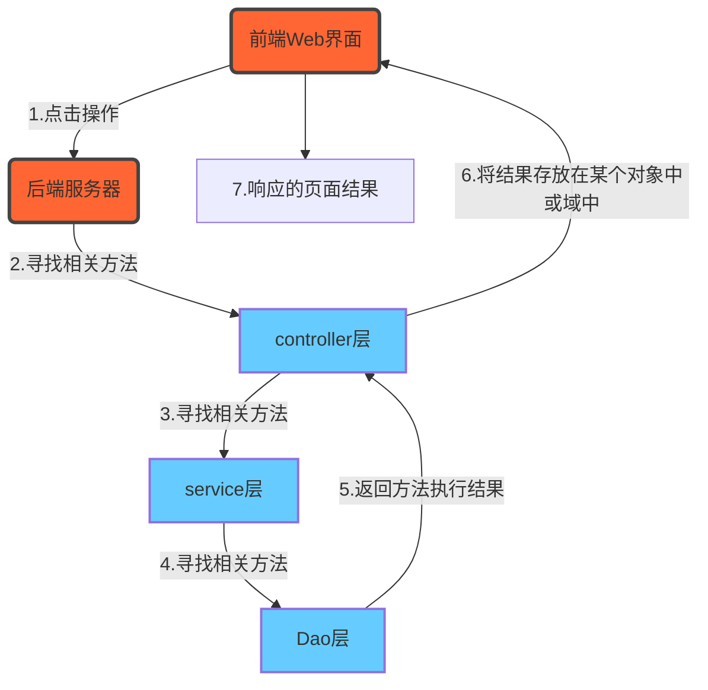

## SSM——Spring练习笔记（一）

### Spring环境搭建步骤

1. 创建工程（Project->Module）
2. 创建webapp文件夹（放入静态页面）
3. 配置pom.xml（导入需要的坐标）
4. 创建包结构（controller、service、dao、domain、utils）
5. 创建POJO类（实体类）
6. 创建配置文件（applicationContext.xml、spring-mvc.xml、jdbc.properties、log4j.properties等）

关于静态页面的说明，当我们需要使页面进行前后端的交互时，这时就需要将静态页面转换成JSP页面，这样我们就可以在JSP页面中使用EL表达式和JSTL表达式进行数据的获取了。

关于包结构的说明，controller就是三层架构中的WEB层，在Spring中被叫做controller；service层就是业务层；domain是存放实体类的包，有时也称为POJO或其他名称；utils包是我们编写的工具类的具体存放位置。这五个包结构是最常见、常用的包结构，有时还需要其他的包，这里根据需求进行创建即可。

关于POJO的说明，当我们的项目需要使用数据库进行数据的操作时，这里的POJO对应的就是数据库中表的结构，一般将POJO叫做实体类，具体存放在POJO包下或domain包下。

关于配置文件的说明，这里的log4j.properties是关于日志处理的相关参数，一般情况下不需要进行编写。jdbc.properties是关于数据库的相关参数，根据具体的需求进行编写即可。其余的两个是关于Spring的配置文件。这些配置文件需要创建，除此之外还要对web.xml进行配置，使得我们的Spring能与Web项目关联起来。

### 编写配置文件相关步骤

创建好Spring和SpringMVC的配置文件后，就需要对相关内容进行配置了，一些配置是固定的配置，一些需要根据实际的业务方法进行配置，这里记录固定的配置步骤。

#### web.xml的配置

使用SSM的WEB项目中，web.xml有这么几个固定配置（1.配置全局初始化参数。2.配置Spring监听器。3.配置SpringMVC前端控制器）具体配置如下：

```xml
<?xml version="1.0" encoding="UTF-8"?>
<web-app xmlns="http://xmlns.jcp.org/xml/ns/javaee"
         xmlns:xsi="http://www.w3.org/2001/XMLSchema-instance"
         xsi:schemaLocation="http://xmlns.jcp.org/xml/ns/javaee http://xmlns.jcp.org/xml/ns/javaee/web-app_4_0.xsd"
         version="4.0">
    <!--  配置全局初始化参数  -->
    <context-param>
        <param-name>contextConfigLocation</param-name>
        <param-value>classpath:applicationContext.xml</param-value>
    </context-param>
    <!--  配置Spring监听器  -->
    <listener>
        <listener-class>org.springframework.web.context.ContextLoaderListener</listener-class>
    </listener>
    <!--  配置SpringMVC前端控制器  -->
    <servlet>
        <servlet-name>DispatcherServlet</servlet-name>
        <servlet-class>org.springframework.web.servlet.DispatcherServlet</servlet-class>
        <init-param>
            <param-name>contextConfigLocation</param-name>
            <param-value>classpath:spring-mvc.xml</param-value>
        </init-param>
        <load-on-startup>2</load-on-startup>
    </servlet>
    <servlet-mapping>
        <servlet-name>DispatcherServlet</servlet-name>
        <url-pattern>/</url-pattern>
    </servlet-mapping>
</web-app>
```

**注意**：这里的`<load-on-startup>2</load-on-startup>`参数可以为`1`也可以为`2`，目的是让服务器启动时就进行创建。`<servlet-name>DispatcherServlet</servlet-name><url-pattern>/</url-pattern>`参数`/`的含义是让服务器启动时所有的请求都先找`/`，如果配置成了`/`，就要在spring-mvc的配置文件中配置资源映射。

#### spring-mvc.xml的配置

固定的配置有（1.配置MVC注解驱动。2.配置内部资源视图解析器。3.配置静态资源权限开放），具体如下：

```xml
<?xml version="1.0" encoding="UTF-8"?>
<beans xmlns="http://www.springframework.org/schema/beans"
       xmlns:xsi="http://www.w3.org/2001/XMLSchema-instance"
       xmlns:mvc="http://www.springframework.org/schema/mvc"
       xsi:schemaLocation="
       http://www.springframework.org/schema/beans http://www.springframework.org/schema/beans/spring-beans.xsd
       http://www.springframework.org/schema/mvc http://www.springframework.org/schema/mvc/spring-mvc.xsd
">
    <!--  配置MVC注解驱动  -->
    <mvc:annotation-driven/>
    <!--  配置内部资源视图解析器  -->
    <bean class="org.springframework.web.servlet.view.InternalResourceViewResolver">
        <property name="prefix" value="/pages/"/>
        <property name="suffix" value=".jsp"/>
    </bean>
    <!--  配置静态资源权限开放  -->
    <mvc:default-servlet-handler/>
    
</beans>
```

**注意：**该文件的名称可以为任何名称，只需要与web.xml中对应即可。为了看起来清晰明了，通常为spring-mvc。

#### applicationContext.xml的配置

若工程中需要与数据库进行交互，这时的固定配置有三个（1.配置加载外部资源文件。2.配置数据源。3.配置jdbc模板），具体如下：

```xml
<?xml version="1.0" encoding="UTF-8"?>
<beans xmlns="http://www.springframework.org/schema/beans"
       xmlns:xsi="http://www.w3.org/2001/XMLSchema-instance"
       xmlns:context="http://www.springframework.org/schema/context"
       xsi:schemaLocation="
       http://www.springframework.org/schema/beans http://www.springframework.org/schema/beans/spring-beans.xsd
">
    <!--  加载外部资源文件  -->
    <context:property-placeholder location="classpath:jdbc.properties"/>
    <!--  配置数据源  -->
    <bean id="dataSource" class="com.mchange.v2.c3p0.ComboPooledDataSource">
        <property name="driverClass" value="${jdbc.driver}"/>
        <property name="jdbcUrl" value="${jdbc.url}"/>
        <property name="user" value="${jdbc.username}"/>
        <property name="password" value="${jdbc.password}"/>
    </bean>
    <!--  配置JDBCTemplate  -->
    <bean id="jdbcTemplate" class="org.springframework.jdbc.core.JdbcTemplate">
        <property name="dataSource" ref="dataSource"/>
    </bean>
</beans>
```

同样文件名可以为任意，但必须与web.xml中的配置对应，通常为applicationContext。此时可以根据项目的技术架构对部分代码或结构进行更新。

### WEB项目的开发要点

在实际项目中通过用户在前端页面的点击操作，后端服务器中所写的代码开始运行，在三层架构中使用Spring框架进行开发时，具体的调用步骤如下：



在实际项目中我们可以通过上述的流程图制定我们某个方法的执行过程，以此来进行代码的编写工作。


