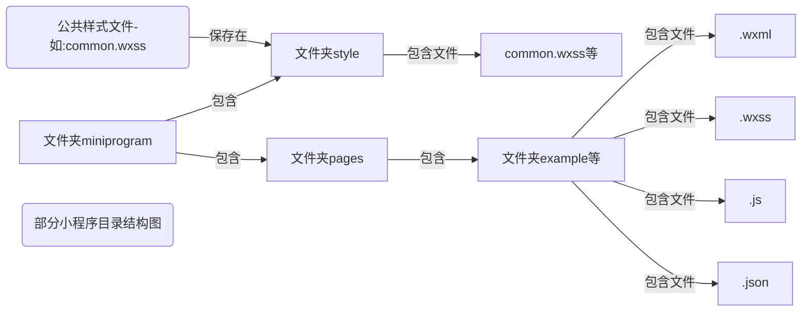
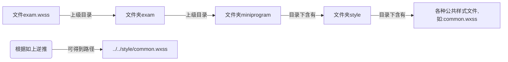

## 微信小程序开发——学习笔记（一）

### 前期准备

+ **软件下载**：
  + Nodejs（8.0以上）
  + 微信开发者工具（使用最新版）

### 微信公众平台/小程序

####  微信公众平台

+ 微信公众平台（涵盖项目）： 2013-(订阅号)、2017-(小程序)、2018-(小游戏)

+ 小程序特点：轻量app，无需下载即可使用，用完即走

####  微信小程序

  **优势：**

+ 基于微信平台，天然的海量用户

+ 无需下载直接使用，节省企业开发成本、推广成本

###  微信小程序——开发工具

 **注意事项：**

 调试基础库版本：2.2.4、2.2.5（或更高）

 云开发版本：2.2.3（最低要求） 

 **常见错误：**

(1)权限错误: 不用理会

(2)函开发未定: 不用理会

(3)addEventListener: 不用理会 

### 微信小程序——创建网页(组件)

#### 创建前准备

1.将pages文件夹下的内容删除

2.将images文件夹下的内容删除

3.app.json文件下的pages数组下的内容删除，并创建pages/.../...文件（如："pages/home/home"）

###  微信小程序文件结构

|       文件名        |          解释          |
| :-----------------: | :--------------------: |
|      app.json       |      全局配置文件      |
| pages目录(己经存在) | 存放所有页面文件的地方 |

 app.json下的`pages:[]`中表示，当前项目中所有网页配置信息，在该数组下的第一行代码就是显示的第一个界面（模拟器显示的第一个）

pages目录下的文件(xxx.wxml、xxx.wxss、xxx.json、xxx.js)

####  微信小程序——wxml

 **介绍：**小程序没有使用html，它使用xml (可扩展标记语言)格式的wxml

**常见标签(组件)**

|      组件       |             解释             |
| :-------------: | :--------------------------: |
|  <view></view>  |  相当于<div></div>块级元素   |
|  <text></text>  |   相当于<span><p>行内元素    |
| <image></image> | 相当于图片元素 |

**开发文档——组件(包含各种标签...)**

> [https://developers.weixin.qq.com/miniprogram/dev/component/icon.html](https://developers.weixin.qq.com/miniprogram/dev/component/icon.html)

#### 微信小程序——wxss(css)

**注意：**wxss的样式语言大多数功能与css相通

 **※**：单位(微信专用)——rpx(responsive pixel)**响应式像素**，可以根据屏幕宽度自动调整元素大小。小程序中rpx，依据当前设置自动调用。

##### **公共样式文件**

用法：@import "样式所在路径"      ----作用：引入公共样式文件

例如：在文件目录下的style文件夹中新建一个common.wxss文件，在该文件中写入css样式后保存文件，那么在其他不同的目录下，若要引入该样式文件，需要在该pages文件下的.wxss文件中的顶端加入`@import "../../style/common.wxss"`代码即可达到引入公共样式文件的目的。



这里的文件夹example可以手动创建，但创建完成后必须在该文件夹下手动创建与文件夹名相同的pages文件；同时也可以自动创建只需打开小程序的app.json文件，在该文件下的pages数组中添加`"pages/文件夹名/文件名"`（注意：文件夹名和文件名最好相同）。

当我们写好公共样式文件后，便可根据小程序的目录结构逆推文件的路径。（PS：个人感觉类似==dos和Linux中的cd ..==返回上级目录）

逆推过程如图：(当前页面的样式文件 exam.wxss)



得到的路径便可在任意页面下的.wxss文件中加入`@import "../../style/common.wxss"`代码，引入公共样式文件。

 **注意**：小程序与网页同名样式文件将自动加载。

####  微信小程序——json(配置文件)

##### json文件介绍

关于部分json文件的介绍

|       文件名        |       解释       |
| :-----------------: | :--------------: |
| project.config.json | 当前项目配置文件 |
|      app.json       |   全局配置文件   |

app.json配置文件中的选项会影响当前项目的所有组件

部分配置文件代码：

```json
{
    //组件列表;第一个组件默认显示在终端中
    "pages":[],    
    //全局窗口样式
    "window": {
        "backgroundColor": "#F6F6F6",//小程序界面背景颜色
        "backgroundTextStyle": "light",
        "navigationBarBackgroundColor": "#F6F6F6",//终端顶部的背景颜色
        "navigationBarTitleText": "云开发 QuickStart",//小程序的标题
        "navigationBarTextStyle": "black"  //标题字体颜色，只能是black和white
    },
}
```

##### app.json文件构造

在小程序中加入底部导航条的写法：在json文件中添加如下代码

```json
"tabBar": {//底部导航条
    "list": [
      {
        "pagePath": "组件路径",//点击按钮时跳转到该组件
        "text": "按钮文本",
        "iconPath": "图标路径",
        "selectedIconPath": "选中时图标路径"
      },
        //例如
      {
        "pagePath": "pages/exam/exam",
        "text": "购物车",
        "iconPath": "images/shopcar.png",
        "selectedIconPath": "images/shopcar_select.png"
      }
    ]
  }
```

 **常见错误**

+  tabBar.list[0].iconPath 文件不存在      **错误原因：**图片路径错误

+ Expecting 'EOF','}',':',',',']', got STRING   **错误原因：**缺少逗号

 **注意**： 

+ 按钮最少为二个，少于二个报错

+ 图片路径只能支持本地图片 (图片路径不能写错) 

+ json文件不能添加注释

#### 微信小程序——js

##### js介绍

介绍：小程序的顶层对象，相当于网页window

小程序下的js文件介绍

| 文件名  |         解释          |
| :-----: | :-------------------: |
| app.js  | 全局js (全局共享数据) |
| exam.js |      当前组件js       |

##### js中的数据传递

js代码如下

```js
Page({
    data: { //表示当前组件对象(属性;方法;事件;数据等)
        msg:'你有一条新消息',
        num:200,
        list:['曼城','曼联','拜仁'] 
    }
})  
```

wxml代码如下

```xml
//通过{{}}方式读取js中的数据
<view>{{msg}}</view> 
<view>{{num}}</view>
<view>{{list}}</view> 
```

### 微信小程序——数据显示与控件

#### for循环

使用方法如下：

+ 可在wxml中的标签中使用for循环，循环读取js中的数据

+ 可在js中使用for循环

代码如下：

``` xml
<view wx:for="{{数组名}}"  wx:key="排序属性">{{item.id}}</view>
```

  

|       属性名        |          解释          |
| :-----------------: | :--------------------: |
|        item         | 默认表示当前数组中对象 |
|        index        |      默认数组下标      |
| wx:for="{{数组名}}" |     指定循环的数组     |
|  wx:key="排序属性"  |                        |

####   if条件判断

  使用方法如下：

+ 可在wxml中的标签中使用if条件判断

+ 可在js中使用if条件判断

  代码如下：

```xml
<view wx:if="{{判断条件}}"></view>
```

| 判断条件(表示达式结果为true/false) |        解释        |
| :--------------------------------: | :----------------: |
|                true                |  当前元素正常显示  |
|               false                | 当前元素将不会显示 |

#### hidden隐藏

示例代码如下：

```xml
<view hidden="{{判断条件}}"></view>
```

| 判断条件(表达式结果为true/false) |      解释      |
| :------------------------------: | :------------: |
|               true               |  当前元素隐藏  |
|              false               | 当前元素不隐藏 |

###  企业级API使用——第三方定位服务商:高德地图/腾讯地图/百度地图

####  微信小程序中的组件——map(绘制地图)

示例代码如下

```xml
<!-- 地图坐标：(103.866419,36.052723)-->
<map id="map" longitude="103.866419" latitude="36.052723" scale="14" style="width:100%;height:600rpx;"></map>
```

**API接口：**

> [百度地图坐标拾取系统](http://api.map.baidu.com/lbsapi/getpoint/index.html)

| map属性名称（部分） |      介绍      |
| :-----------------: | :------------: |
|      longitude      |  中心位置经度  |
|      latitude       |  中心位置纬度  |
|        scale        | 缩放级别  3~20 |

 

 

 

 

 

 

 