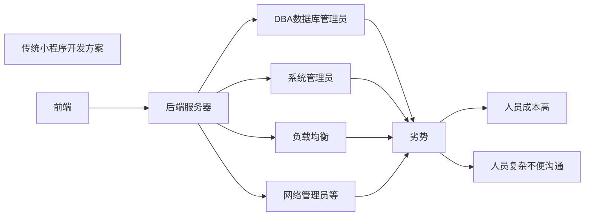
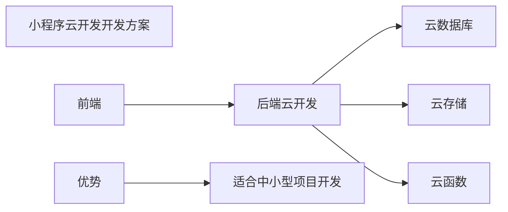

## 微信小程序开发——学习笔记（二）

### 微信小程序基本概念——事件

#### 不同终端的操作方法

**PC端操作**：键盘、鼠标

**移动端操作**：手指

#### 事件类型介绍

|  事件类型  |             解释             |
| :--------: | :--------------------------: |
| touchstart |    手指触发屏幕时发生事件    |
| touchmove  |        手指在屏幕滑动        |
|  touchend  |         手指离开屏幕         |
|    tap     | 手指触发屏幕立即离开触发事件 |

#### 微信小程序——事件绑定元素

**事件绑定语法：**

`<view bind事件名="函数"></view>`，标签中的绑定元素有很多，例如绑定点击事件"bindtap"，其他绑定元素还有很多，详见微信开发文档。

代码示例：

```xml
<!--这里将标签view绑定点击事件，事件名为handle，当点击该标签时，事件生效-->
<view bindtap="handle"></view>
```

### 微信小程序基本概念——生命周期（组件wxml）

**定义：**组件生命周期是指一个组件从创建开始到使用到最后被销毁的过程。

#### js文件下的基本事件介绍

|  事件名  |           解释           |     可触发次数     |
| :------: | :----------------------: | :----------------: |
|  onLoad  | 组件创建成功并且加载完成 |      触发一次      |
| onReady  |       组件渲当成功       |      触发一次      |
|  onShow  |       组件显示完成       |      触发多次      |
|  onHide  |       组件隐藏完成       |      触发多次      |
| onUnload |         组件销毁         | 触发一次(谨慎使用) |

 **注意：**

+ 当onLoad事件触发发送请求获取数据时（获取其它组件传递数据 ），可使用options.······获取其他组件的数据。

+ 隐藏组件通过切换后台实现

+ 销毁组件通过跳转组件实现

 **小技巧：**

 如何通过js获取data中数据，或者修改data中的数据？

 如：data:{ msg:"hello"}

 获取data中数据：this.data.msg

 修改data中数据：this.setData({msg:"js"})

#### 跳转事件

例如：在小程序界面上的任意组件上加入跳转事件，点击该组件即可事件跳转界面操作

用法：在小程序的组件上添加点击事件，在js界面上的该事件函数下加入如下代码，即可实现跳转

```js
 wx.redirectTo({//跳转界面函数
      url: '/pages/exam/exam',//目标页面的路径或url
    })
```

**跳转界面函数传递参数**

利用url的字段拼接即可实现参数传递，代码如下：

```js
wx.redirectTo({
      url: '/pages/exam/exam?id=13&age=11',//向目标界面传递两个参数id和age，使用?拼接参数
    })
```

若在目标界面需要使用传递过去的参数，在目标界面的js中的data中先声明参数名，之后在页面加载函数onLoad中使用`this.setDate({参数名:options.参数名})`将传递过来的参数保存，也可使用`console.log(options)`将传递过来的数据打印在控制台中，若要显示在页面中，直接调用data中保存的数据即可。

### 微信小程序云开发

#### 基本介绍

云开发涵盖内容：云函数、云数据库、云存储

传统小程序与云开发小程序的基本开发工作



传统小程序对中小型企业而言，开发成本较高



**小程序开发云服务器**

开通步骤：

+ 小程序开发工具中点击"云开发"按钮
+ 填写环境名称，点击"确定"

**注意**：环境名称不能有中文不能以空格字母开头

#### 云数据库介绍

小程序中的云数据库为文档型数据库非关系型数据库

云数据库的创建方法

+ 第一步：开通云开发服务器服务
+ 第二步：在云开发控制台中创建集合
+ 第三步：为集合添加记录

这里创建数据库及后续的操作皆是可视化界面操作，非常简单

**云数据库与关系型数据库对比**

| 关系型数据库 |      云数据库mongodb       |
| :----------: | :------------------------: |
| 库 database  | 库 database (环境默认一个) |
|   表 table   |      集合 collection       |
|    行 row    |        记录 record         |
|  列 column   |         字段 field         |

 关系型数据库：适合方式企业内部系统的复杂关系

 mongodb：适合互联网项目（频繁查询/更新）、移动app

#### 操作云数据库方式

+ 操作方式一：云开发控制台（创建添加修改）

+ 操作方式二：小程序中（创建添加修改）与当前操作用户相关

+ 操作方式三：云函数权限最高（利用云函数操作数据库）

##### 数据库的添加数据操作

在JS中对数据库进行操作的步骤：

+ 创建数据库对象（获取默认数据库对象实例）

  在js页面顶部添加`const db = wx.cloud.database();`代码，引入数据库对象实例

+ 向指定集合中添加一条记录

  创建代码示例如下：

  ```js
  db.collection("集合名称")//指定所要操作的数据库
  .add({//数据库的添加操作（相当于插入Insert）
      data:{//将所添加的数据与属性名对应
          属性名:值,
          属性名:值...
      }
  }).then(res=>{  //函数执行成功的回调函数
      console.log(res);
  }).catch(err=>{  //函数执行失败的回调函数
      console.log(err);
  })
  ```

  **注意**：

  + 上述代码应在创建好的事件函数中
  + 数据库中自动创建的openid是微信系统标识用户身份的唯一编号（open_id：当前登录用户的id）

 **常见错误**：database collection not exists

​     解释：数据库中的集合不存在（集合没有创建成功/集合名称拼写错误）

##### 数据库的更新数据操作

代码如下：

```js
db.collection("集合名称")
.doc("当前记录id")   //在控制台查看需要操作的数据的id值并将其填写在括号中
.update({
  data:{//将需要修改的值与字段对应
      age:23
  }
})
.then(res=>{//执行成功的回调函数
})
.catch(err=>{
   //执行失败的回调函数
})
```

##### 数据库的查询数据操作

代码如下：

```js
db.collection("集合名称")
.get().then(res=>{}).catch(err=>{})
```

不加限定的查询直接使用.get()函数，会将数据库中的全部记录查询出来

如下代码为添加限定的查询操作：

```js
db.collection("集合名称")
.where({//加入限定，只查询姓名是bench的记录
name:"bench"
})
.get()
.then(res=>{})
.catch(err=>{})
```

##### 数据库的删除数据操作

**注意**：小程序端只能一次删除一条记录

代码如下：

```js
db.collection("集合名称")
.doc("当前记录_id")   //在控制台查看需要操作的数据的id值并将其填写在括号中
.remove()
.then(res=>{console.log()})
.catch(err=>{})
```

#### 云存储简单介绍

云存储所能进行的操作：可将本地的图片、文件上传到云存储中，（上传图片/下载文件/文件管理）

#### 云函数简单介绍

云函数的定义：简洁的node.js服务器函数

> 云存储与云函数这里不再详细介绍，详见学习笔记三