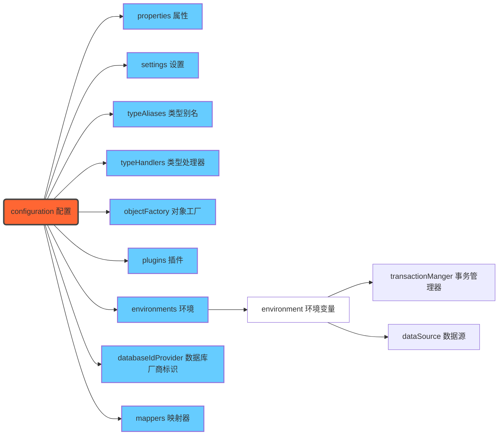

## 持久层框架学习——MyBatis（一）

### 使用原始JDBC操作数据库的缺点

1. 数据库的连接创建和释放的频繁造成系统资源浪费影响系统的性能。
2. 使用PreparedStatement时SQL语句中的占位符传参存在硬编码，造成代码不易维护，若改动SQL语句还需要改动Java代码。
3. 查询操作时，需要手动将结果集封装在实体中；插入操作时，需要手动将实体数据设置到SQL语句的占位符位置。如果进行修改需要对大量的代码进行修改，不利于维护。

**解决设想**：

1. 使用数据库连接池管理数据库的连接。
2. 将相关的SQL语句提取出来，在配置文件中进行配置，此时在进行修改时只需要修改配置文件即可。
3. 可以使用反射、内省等底层技术，自动将实体与表进行属性与字段的字段映射。

### MyBatis介绍

MyBatis是Java开发中的一个持久层框架，它内部封装了JDBC，这样使得我们只需要写SQL语句，不用去管加载驱动、创建连接、创建Statement等过程。MyBatis通过XML或注解的方式将要执行的各种Statement配置起来，并通过Java对象和Statement中SQL的动态参数进行映射生成最终执行的SQL语句。最后MyBatis框架执行SQL后将结果映射成Java对象返回。采用了**ORM**（对象关系映射）的思想解决了实体和数据库映射的问题，对JDBC进行了封装，屏蔽JDBC API底层访问的细节，使得我们不用去处理原生JDBC就能对数据库进行持久化的操作。

### MyBatis简单使用

**步骤**：

①导入MyBatis的坐标。-->②创建一个数据表。-->③编写数据表字段对应的实体类。-->④编写映射文件`XxxMapper.xml`或`XxxMapping.xml`。-->⑤编写核心文件`SqlMapConfig.xml`。-->⑥测试

第一步：导入MyBatis坐标，这里还是采用Maven进行项目依赖管理，所以不需要手动去导包。如果不用Maven，可以在[mybatis官网](http://www.mybatis.org/mybatis-3/ )下载相应的jar包。做法如下：

```xml
<dependencies>
    <dependency>
        <groupId>mysql</groupId>
        <artifactId>mysql-connector-java</artifactId>
        <version>5.1.32</version>
    </dependency>
    <dependency>
        <groupId>junit</groupId>
        <artifactId>junit</artifactId>
        <version>4.12</version>
        <scope>test</scope>
    </dependency>
    <dependency>
        <groupId>log4j</groupId>
        <artifactId>log4j</artifactId>
        <version>1.2.17</version>
    </dependency>
    <!--    引入MyBatis    -->
    <dependency>
        <groupId>org.mybatis</groupId>
        <artifactId>mybatis</artifactId>
        <version>3.4.6</version>
    </dependency>
</dependencies>
```

第二步：创建一个数据表。这个可以在自己的数据库中采用任何一个表都行。

第三步：编写数据表字段对应的实体类。这一步就是之前创建实体对象中的创建实体类，根据表的设计进行相应的创建即可。

第四步：编写映射文件`UserMapping.xml`。具体如下：

```xml-dtd
<?xml version="1.0" encoding="UTF-8" ?>
<!DOCTYPE mapper PUBLIC "-//mybatis.org//DTD Mapper 3.0//EN" "http://mybatis.org/dtd/mybatis-3-mapper.dtd">
<mapper namespace="userMapping">
    <select id="findAll" resultType="com.jclight.domain.User">
        select * from user
    </select>
</mapper>
```

第五步：编写核心文件`SqlMapConfig.xml`。具体如下：

```xml-dtd
<?xml version="1.0" encoding="UTF-8" ?>
<!DOCTYPE configuration PUBLIC "-//mybatis.org//DTD Config 3.0//EN" "http://mybatis.org/dtd/mybatis-3-config.dtd">
<configuration>
    <!--  数据源环境  -->
    <environments default="Developement">
        <environment id="Developement">
            <transactionManager type="JDBC"/>
            <dataSource type="POOLED">
                <property name="driver" value="com.mysql.jdbc.Driver"/>
                <property name="url" value="jdbc:mysql://localhost:3306/test"/>
                <property name="username" value="root"/>
                <property name="password" value="root"/>
            </dataSource>
        </environment>
    </environments>
</configuration>
```

第六步：测试

### MyBatis配置文件

在持久层使用MyBatis框架开发时，我们需要对MyBatis的两大配置文件进行配置才可以使用，这两大就是映射文件和核心配置文件。

#### 映射文件

关于映射文件的命名，我们对哪个实体进行操作就使用`实体名+Mapper/Mapping.xml`进行命名，例如`UserMapper.xml、ProductMapping.xml`。关于映射文件的部分代码介绍如下：

```xml-dtd
<!DOCTYPE mapper PUBLIC "-//mybatis.org//DTD Mapper 3.0//EN" "http://mybatis.org/dtd/mybatis-3-mapper.dtd">
```

这个部分是映射文件DTD的约束头，它的作用可以帮助我们提示映射文件的编写和约束，DTD文件头就是一种约束，只要文件中有DTD约束头，编译器或浏览器就能根据该约束进行相应的操作，这里的指定约束是mapper，一个规范的HTML文件中，它的约束头指定的就是HTML。当不指定约束头或不编写约束头时，浏览器就不能显示出我们文件中的所有代码的页面展示。或者编译器就不能对该文件进行准确的识别。

```xml-dtd
<mapper namespace="UserMapping"></mapper>
```

该标签是映射文件中的根标签，属性namespace是命名空间，和下面不同的SQL标签的id组成标识。这里的namespace的值一般来讲要写成包的形式，但这种不是固定死的，一般要根据项目的结构来填写这里的值。

```xml-dtd
<select id="findAll" resultType="com.jclight.domain.User">
	select * from user
</select>
```

该标签是SQL标签，除此之外还有insert、update、delete。这里的id与上面的namespace对应组成标识，resultType结果类型，一般对应的是实体类型，它的值是对应实体类型的全包名，指定全包名后框架就会使用反射机制来将我们的查询结果自动封装成我们想要的对象了。在该标签的内部编写要执行的SQL语句。

#### 核心配置文件

##### 配置文件中标签的层级关系



##### 常用标签配置

在MyBaits的核心配置文件中，前两行是文件的约束，这个约束和Mapper文件的约束不一样，如下所示：

```xml-dtd
<?xml version="1.0" encoding="UTF-8" ?>
<!DOCTYPE configuration PUBLIC "-//mybatis.org//DTD Config 3.0//EN" "http://mybatis.org/dtd/mybatis-3-config.dtd">
<configuration>
</configuration>
```

后面的两行，也就是`<configuration>`标签是核心配置文件的根标签，在根标签下又有很多标签代表了不同的含义，具体如层级关系所示。

###### environments 标签

`<environments>`标签是数据库环境的配置，它支持多环境的配置，它的属性default代表指定默认的环境名称。在其下又有`<environment>`标签，它有属性id代表指定当前环境的名称。所以在标签environments下可以配置多种环境，指定默认的环境只需要属性default的值和id的值相互对应即可。

在environment标签下又有`<transactionManager>`标签，它的作用是指定事务管理，属性type就是指定事务管理的类型是什么，例如JDBC等。这里的type的类型有两种，一种是JDBC，使用JDBC作为事务管理器就是直接使用了JDBC的提交和回滚设置，它依赖于从数据源得到的连接来管理事务作用域。另一种是MANAGED，使用这种不会提交和回滚连接，而是让容器来管理事务的整个生命周期。默认下会关闭连接，然而有些容器不希望如此，所以可以通过设置closeConnection属性的值为false来阻止它默认关闭的行为。

在`<environment>`标签下还有的`<dataSource>`标签，它的作用是指定当前的数据源的类型，属性type和上面一样是指定当前的数据源类型，例如POOLED表示数据源类型是连接池。这里的type有三种，其中UNPOOLED值表示数据源的实现只是在每次被请求时打开或关闭连接。POOLED表示数据源实现利用池的概念将JDBC对象组织连起来。JNDI属性表示实现能在如EJB应用中或应用服务器这类容器中使用，容器可以集中或在外部配数据源，然后放在一个JNDI上下文的引用。

###### mapper 标签

该标签的作用是加载映射的，它的位置在标签mappers内部，加载映射方式有如下的几种：

1. 使用相对于类路径的资源的引用，例如：

   ```xml-dtd
   <mapper resource="com\jclight\mapper\UserMapper.xml"/>
   ```

2. 使用完全限定资源定位符URL，例如：

   ```xml-dtd
   <mapper url="file:///var/mappers/UserMapper.xml"/>
   ```

3. 使用映射器接口实现类的完全限定类名，例如：

   ```xml-dtd
   <mapper class="com.jclight.mapper.UserMapper"/>
   ```

4. 将包内的映射器接口实现全部注册为映射器，例如：

   ```xml-dtd
   <package name="com.jclight.mapper"/>
   ```

###### Properties 标签

该标签的作用和Spring中导入外部资源文件一样，它也是通过该标签进行导入，然后在MyBatis的核心配置文件中使用MyBatis提供的表达式进行提取。例如：

```xml
<!--  导入外部资源文件  -->
<properties resource="jdbc.properties"/>  
<!--  数据源环境  -->
<environments default="Developement">
    <environment id="Developement">
        <transactionManager type="JDBC"/>
        <dataSource type="POOLED">
            <property name="driver" value="${jdbc.driver}"/>
            <property name="url" value="${jdbc.url}"/>
            <property name="username" value="${jdbc.username}"/>
            <property name="password" value="${jdbc.password}"/>
        </dataSource>
    </environment>
</environments>
```

###### typeAliases 标签

它的作用是为类型别名设置一个简短的名字。例如：

```xml
<typeAliases>
     <typeAlias type="com.jclight.domain.User" alias="user"/>
</typeAliases>
```

此时在映射文件中，可以修改为：

```xml
<select id="findAll" resultType="user">
        select * from user;
</select>
```

**注意**：该标签在核心配置文件中有位置规定，必须编写在合适的位置之后才能使用，一般来说观察IDEA所提示的错误进行位置的修改即可。此外，MyBatis将我们常用的基本数据类型及其对应的包装类也做了相应的别名，例如java.lang.Integer可以省略为int等。

### MyBatis的简单增删改查

#### MyBatis的添加操作

```xml-dtd
<?xml version="1.0" encoding="UTF-8" ?>
<!DOCTYPE mapper PUBLIC "-//mybatis.org//DTD Mapper 3.0//EN" "http://mybatis.org/dtd/mybatis-3-mapper.dtd">
<mapper namespace="UserMapper">
    <!--  插入操作  -->
    <insert id="save" parameterType="com.jclight.domain.User">
        insert into user values(#{id},#{username},#{password});
    </insert>
</mapper>
```

**注意**：这里的SQL标签为insert，属性parameterType是输入类型，这里根据数据表填写相应的输入类型。SQL语句中原有的占位符`?`在这里是`#{}`，括号中的值对应实体的属性名。

测试如下：

```java
@Test
public void Insert() throws IOException {
    User user = new User();
    user.setUsername("尼古拉斯赵四");
    user.setPassword("aaa");
    
    InputStream resourceAsStream = Resources.getResourceAsStream("SqlMapConfig.xml");
    SqlSessionFactory sqlSessionFactory = new SqlSessionFactoryBuilder().build(resourceAsStream);
    SqlSession sqlSession = sqlSessionFactory.openSession();
    sqlSession.insert("UserMapper.save", user);
    //MyBatis执行更新操作 提交事务
    sqlSession.commit();
    sqlSession.close();
}
```

这里是利用MyBatis的API进行的数据库操作，所以是一个简单的单元测试，便于学习，但是在开发中是不存在这样的写法的，请注意。

**注意**：MyBatis执行更新操作（增删改）时，数据库事务默认是不提交的，所以在我们进行测试的时候需要提交事务。

#### MyBatis的删除操作

映射文件如下：

```xml-dtd
<?xml version="1.0" encoding="UTF-8" ?>
<!DOCTYPE mapper PUBLIC "-//mybatis.org//DTD Mapper 3.0//EN" "http://mybatis.org/dtd/mybatis-3-mapper.dtd">
<mapper namespace="UserMapper">
	<!--  删除操作  -->
    <delete id="delete" parameterType="java.lang.Integer">
        delete from user where id=#{id};
    </delete>
</mapper>
```

测试如下：

```java
@Test
public void DeleteUser() throws IOException {
    InputStream resourceAsStream = Resources.getResourceAsStream("SqlMapConfig.xml");
    SqlSessionFactory sqlSessionFactory = new SqlSessionFactoryBuilder().build(resourceAsStream);
    SqlSession sqlSession = sqlSessionFactory.openSession();
    sqlSession.delete("UserMapper.delete", 12);
    //MyBatis执行更新操作 提交事务
    sqlSession.commit();
    sqlSession.close();
}
```

**注意**：如果要操作数据库表中的单个数据，也就是在映射文件中的SQL语句中只有一个使用占位符的参数时，此时在MyBatis的增删改API中的传递的参数的要对应`parameterType`属性值所写的类型。而在映射文件中的占位符中的名称可以为任何值。如果操作的多个数据，就不行了。除此之外，也要看`parameterType`的值是什么，如果是基本数据类型且占位符只有一个时，可以使用任何值作为占位符中的填充值，如果不是基本数据类型且占位符只有一个，这时就需要使用实体对象对应的属性值的名称。

#### MyBatis的修改操作

映射文件如下：

```xml-dtd
<?xml version="1.0" encoding="UTF-8" ?>
<!DOCTYPE mapper PUBLIC "-//mybatis.org//DTD Mapper 3.0//EN" "http://mybatis.org/dtd/mybatis-3-mapper.dtd">
<mapper namespace="UserMapper">
	<!--  修改操作  -->
    <update id="update" parameterType="com.jclight.domain.User">
        update user set username=#{username},password=#{password} where id=#{id};
    </update>
</mapper>
```

测试如下：

```java
@Test
public void UpdateUser() throws IOException {
    User user = new User();
    user.setUsername("尼古拉斯赵四");
    user.setPassword("aaa");
    
    InputStream resourceAsStream = Resources.getResourceAsStream("SqlMapConfig.xml");
    SqlSessionFactory sqlSessionFactory = new SqlSessionFactoryBuilder().build(resourceAsStream);
    SqlSession sqlSession = sqlSessionFactory.openSession();
    sqlSession.insert("UserMapper.save", user);
    //MyBatis执行更新操作 提交事务
    sqlSession.commit();
    sqlSession.close();
}
```

**注意**：此时用到的MyBatis的API是insert。插入与修改操作的API都含有两个参数，第一个参数对应的映射文件的`namespace.id`组合，第二个参数是传入映射文件的操作对象。

#### MyBatis的查询操作

映射文件如下：

```xml-dtd
<?xml version="1.0" encoding="UTF-8" ?>
<!DOCTYPE mapper PUBLIC "-//mybatis.org//DTD Mapper 3.0//EN" "http://mybatis.org/dtd/mybatis-3-mapper.dtd">
<mapper namespace="userMapping">
    <select id="findAll" resultType="com.jclight.domain.User">
        select * from user
    </select>
</mapper>
```

测试如下：

```java
public class MyBatisTest {
    @Test
    public void test1() throws IOException {
        //获得核心配置文件
        InputStream resourceAsStream = Resources.getResourceAsStream("SqlMapConfig.xml");
        //获得session工程对象
        SqlSessionFactory sqlSessionFactory = new SqlSessionFactoryBuilder().build(resourceAsStream);
        //获得session会话对象
        SqlSession sqlSession = sqlSessionFactory.openSession();
        //执行操作 参数：namespace.id
        List<User> userList = sqlSession.selectList("userMapping.findAll");
        //展示数据
        System.out.println(userList);
        //释放资源
        sqlSession.close();
    }
}
```

**注意**：上述的测试代码是使用MyBatis提供的相关API进行的操作，除此之外我们可以使用Spring来集成MyBatis从而简化上述的代码。

### MyBatis相关API

MyBatis相关的API如下：

|                        API                        |                             描述                             |
| :-----------------------------------------------: | :----------------------------------------------------------: |
| SqlSessionFactory  build(InputStream inputStream) | 通过加载mybatis的核心文件，以输入流的形式构建一个SqlSessionFactory对象 |
|             SqlSession openSession()              | 默认开启一个事务，但事务不会自动提交，所以需要手动去提交事务，提交后更新操作数据才会持久化到数据库中 |
|    SqlSession openSession(boolean autoCommit)     |       参数为是否自动提交，若为true则不需要手动提交事务       |

上表中的第一个API其实就是使用SqlSession工厂构造器SqlSessionFactoryBuilder来得到一个SqlSessionFactory，例如：

```java
String resource = "SqlMapConfig.xml"; 
InputStream inputStream = Resources.getResourceAsStream(resource); 
SqlSessionFactoryBuilder builder = new SqlSessionFactoryBuilder(); 
SqlSessionFactory factory = builder.build(inputStream);
```

这里面的`Resources`是一个工具类，该类可以帮助我们从类路径下、文件系统或WEB URL中加载资源文件。

第二个和第三个API都是使用SqlSession工厂对象SqlSessionFactory创建SqlSession的实例的。

其中最重要的一个对象就是SqlSession对象，主要有两方面的作用，一是帮助我们执行语句的操作，二是帮助我们操作事务，它的相关API如下：

|                             API                              |
| :----------------------------------------------------------: |
|    `<T> T selectOne(String statement, Object parameter)`     |
| `<E> List<E> selectList(String statement, Object parameter)` |
|       `int insert(String statement, Object parameter)`       |
|       `int update(String statement, Object parameter)`       |
|       `int delete(String statement, Object parameter)`       |
|                       `void commit()`                        |
|                      `void rollback()`                       |

其中前五个是用来执行语句（查增改删）的操作，后两个是提交事务和回滚事务的操作。

### MyBaits的DAO层的实现方式

#### 传统方式

传统方式的步骤就是先创建对应的实体Mapper接口，在其中创建需要的操作数据库的方法，之后创建该接口的实现，创建完成后，实现接口下的方法，最后进行测试即可。这里的三个配置文件不变，和上述一致。接口如下：

```java
public interface UserMapper {
    /**
     * 在User表中查询全部数据
     *
     * @return User对象组成的集合
     * @throws IOException 将IO异常抛出
     */
    List<User> findAll() throws IOException;
}
```

实现类如下：

```java
public class UserMapperImpl implements UserMapper {
    @Override
    public List<User> findAll() throws IOException {
        InputStream inputStream = Resources.getResourceAsStream("SqlMapConfig.xml");
        SqlSessionFactory sqlSessionFactory = new SqlSessionFactoryBuilder().build(inputStream);
        SqlSession sqlSession = sqlSessionFactory.openSession();
        List<User> userList = sqlSession.selectList("UserMapper.findAll");
        return userList;
    }
}
```

测试如下：

```java
public static void main(String[] args) throws IOException {
        UserMapper userMapper = new UserMapperImpl();
        List<User> users = userMapper.findAll();
        System.out.println(users);
}
```

这种方式是比较繁琐的一种方式不是很常用，当我们使用插件MyBatisX时，写好对应的dao方法后会出现一只鸟的标志，通过该标志就可以找到我们在配置文件中写的对应的配置了。所以我们可以通过插件的跳转显示来判别我们写的是否是规范的。

#### 接口代理方式

使用这种方式只需要去编写Mapper接口，由框架根据接口定义创建接口的动态代理对象，代理对象的方法体就是使用传统方式实现接口的方法体。但是这种方式需要遵循规范，如：Mapper.xml文件中的namespace和mapper接口的全限定名相同、Mapper接口方法名和Mapper.xml中定义的每个statement的id相同、Mapper接口方法的输入参数类型和Mapper.xml中定义的每个sql的parameterType的类型相同、Mapper接口方法的输出参数类型和Mapper.xml中定义的每个sql的resultType的类型相同。这种方式也是目前的主流开发方式，上述所说的使用插件进行辅助开发，在这里得以运用。具体操作如下：

映射文件：

```xml
<?xml version="1.0" encoding="UTF-8" ?>
<!DOCTYPE mapper PUBLIC "-//mybatis.org//DTD Mapper 3.0//EN" "http://mybatis.org/dtd/mybatis-3-mapper.dtd">
<mapper namespace="com.jclight.mapper.UserMapper">
    <select id="findAll" resultType="user">
        select * from user;
    </select>
    <select id="findById" resultType="user" parameterType="int">
        select * from user where id=#{id};
    </select>
</mapper>
```

接口：

```java
public interface UserMapper {
    /**
     * 在User表中查询全部数据
     *
     * @return User对象组成的集合
     * @throws IOException 将IO异常抛出
     */
    List<User> findAll() throws IOException;

    /**
     * 根据id进行查询
     *
     * @param id 用户id
     * @return User对象
     */
    User findById(int id);
}
```

测试：

```java
 @Test
public void findByIdTest() throws IOException {
    InputStream resourceAsStream = Resources.getResourceAsStream("SqlMapConfig.xml");
    SqlSessionFactory sqlSessionFactory = new SqlSessionFactoryBuilder().build(resourceAsStream);
    SqlSession sqlSession = sqlSessionFactory.openSession();
    com.jclight.mapper.UserMapper mapper = sqlSession.getMapper(com.jclight.mapper.UserMapper.class);
    User user = mapper.findById(1);
    System.out.println(user);
}
```

如此便会执行成功，这样的方式不需要我们去写实现就可以执行数据库操作。之后还可以使用Spring框架集成MyBatis将代码简化等。插件的跳转提示如下图：


此时就可以进行相应的跳转了，后期开发中我们的方法过多不易快速找到对应的配置，所以使用该插件可以很好的帮助我们进行定位。